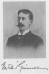

  
[Intangible Textual Heritage](../../../index)  [Native
American](../../index)  [Plains](../index)  [Index](index) 
[Next](pots01) 

------------------------------------------------------------------------

[Buy this Book at
Amazon.com](https://www.amazon.com/exec/obidos/ASIN/0803270089/internetsacredte)

------------------------------------------------------------------------

*The Punishment of the Stingy and Other Indian Stories*, by George Bird
Grinnell, \[1901\], at Intangible Textual Heritage

------------------------------------------------------------------------

# The Punishment of the Stingy and Other Indian Stories

###### by

### George Bird Grinnell

#### New York; London: Harper & Brother Publishers

#### \[1901\]

Scanned, proofed and formatted September 2007, at Intangible Textual
Heritage by John Bruno Hare. This text is in the public domain in the US
because it was published prior to 1923, and can be used for any purpose.

[  
Click to enlarge](img/front.jpg)  
Frontispiece: photograph of George Bird Grinnell  

------------------------------------------------------------------------

[Next: Contents](pots01)
