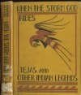
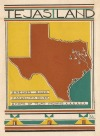
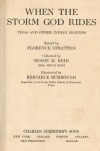
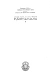

  
[Intangible Textual Heritage](../../../index)  [Native
American](../../index)  [Southeast](../index)  [Index](index) 
[Next](wsgr01) 

------------------------------------------------------------------------

*When the Storm God Rides*, by Florence Stratton, collected by Bessie M.
Reid \[1936\], at Intangible Textual Heritage

------------------------------------------------------------------------

WHEN THE  
STORM GOD RIDES

[  
Click to enlarge](img/cover.jpg)  
Cover and spine  

[  
Click to enlarge](img/front.jpg)  
Frontispiece  

# WHEN THE

# STORM GOD RIDES

##### TEJAS AND OTHER INDIAN LEGENDS

###### Retold by

### FLORENCE STRATTON

###### Collected by

### BESSIE M. REID

###### (MRS. BRUCE REID)

###### Illustrated by

#### BERNIECE BURROUGH

*Supervisor of Art in the Public Schools of Beaumont, Texas*

#### CHARLES SCRIBNER'S SONS

#### NEW YORK     CHICAGO     BOSTON     ATLANTA SAN FRANCISCO     DALLAS

#### \[1936\]

[  
Click to enlarge](img/title.jpg)  
Title Page  

[  
Click to enlarge](img/verso.jpg)  
Verso  

Scanned at Intangible Textual Heritage, January, 2007. Proofed and
formatted by John Bruno Hare. This text is in the public domain in the
United States because it was published between 1923 and 1963 and was not
renewed at the US Copyright Office in a timely fashion as required by
law. These files may be used for any non-commercial purpose provided
this notice is left intact in all copies.

------------------------------------------------------------------------

[Next: Foreword](wsgr01)
