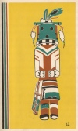

  
[Intangible Textual Heritage](../../../index)  [Native
American](../../index)  [Southeast](../index)  [Index](index) 
[Previous](wsgr04)  [Next](wsgr06) 

------------------------------------------------------------------------

*When the Storm God Rides*, by Florence Stratton, collected by Bessie M.
Reid \[1936\], at Intangible Textual Heritage

------------------------------------------------------------------------

p. 15

### Kachina Brings the Spring

An Indian tribe living in the south-western country was once filled with
fear and suffering. It was the beginning of spring, when the green buds
should have been peeping from the trees, and new flowers should have
been lifting their fresh, cheery faces from the grass, but something was
wrong with this springtime. It was not like spring. There was no rain
from the hard blue skies that looked down without tears of pity on the
hills and prairies that would not flower and the dry creek beds where
water used to flow. And the weather should have been warm, but it was
bitter cold. In the day the sun was far away and had

p. 16

no heat. In the night the moon and stars were like cold steel in the
wide, black sky, where no clouds floated.

And because of these things the Indians suffered great hunger. There was
little food, only parched corn and acorns and shreds of dried buffalo
meat. Gone were the wild deer, flown away were the wild turkeys, gone
were the buffaloes. The animals and the birds which the Indians used to
shoot and eat could not live there without water and food, and they had
died or had left the country. And the berries that the tribe needed to
eat could not grow in the dry, hard earth. There was no rain to call
them up from their sleep under the ground.

The Indians wandered over the hills in

[  
Click to enlarge](img/01600.jpg)

p. 17

search of food, but they could find none, and they began to starve, the
skin on their bodies became loose, their bones began to show through
their flesh. Their women and children grew weak and moaned or cried in
the night because they were hungry.

One night the tribe's medicine man, the wrinkled, wise old Indian who
warded off the evil spirits and who knew how to get the good spirits to
grant the Indians’ wishes, came out of his wigwam and beat loudly on his
drum. He was calling the tribe to come to listen to him. The Indians
hurried around him and watched him in fear as he pounded on his drum and
danced and shouted a song. The starving dogs, when they saw his painted

p. 18

face and his red eyes burning with the light of the camp fires, howled
and ran away with their tails between their legs and hid. They knew
there was a strange power working in him.

Suddenly the medicine man cried to the Indians, "Ho! Hear me! The Great
Spirit has thundered in my ears and told me to speak. He has taken away
from us the rain and the flowers and the animals because we have angered
him. But he will give us help if we will make him a burnt offering. We
must burn something which we love most and gather its ashes and scatter
them to the four winds of heaven. Then the winds will carry the ashes to
the Great Spirit and he will be pleased again. Go back to your wigwams

p. 19

and think what we love most. Tomorrow we will burn it when the sun
rises."

Among the Indians who listened to the medicine man was a little girl.
She was holding in her thin arms a wonderful kachina doll made for her
by her grandmother. This kachina was far prettier than any of the others
in the tribe. It was made of wood carved with a flint knife. Painted on
the wooden form were the clothes of a warrior, an Indian brave. On its
head was a war bonnet of blue feathers and its eyes were made of two
little black beads dyed from berries. The little Indian maiden loved her
kachina, carried it with her when she played and slept with it in her
arms at night.

p. 20

When this little girl heard what the Great Spirit wanted she almost
cried, for she felt in her heart that nothing among her people was more
loved than her own doll. But she looked up and saw the shadows of pain
in the face of her hungry mother. She saw how thin was the face of her
baby brother strapped to his mother's back in his cradle. She remembered
low moans in the wigwams at night, and she knew her people suffered
because the Great Spirit was angry. She looked down at her beloved
little doll, held it tightly to her breast and slipped away to her
father's wigwam where she lay for long time with her face pressed close
against her doll.

The lodges were still and the fire in

p. 21

the middle of the camp had died down to red embers when the little girl
came out again. In her arms was her doll. She knew she loved her kachina
more than anything else was loved in the tribe, and she had decided to
give it up as the Great Spirit had asked, so that her people would be
happy again. She cried a little bit as she laid twigs on the dying
embers of the fire. But she blew the fire until it sprang up into a
blaze that made the shiny eyes of her doll sparkle, so they seemed to be
bright with tears, like her own. She hugged the doll and kissed it. Now
she laid it in the middle of the flames. Quickly the flames began to eat
the doll. The blue feathers on its head were gone, the tiny

p. 22

shoes turned into smoke, the beady eyes fell off the burning face into
the fire, and soon there was nothing left of the doll the little girl
had loved.

Now she raked out the ashes and sat down to watch them cool. When they
had cooled she took them in her two hands and held them up while the
cool wind blew them out of her hands and into the darkness. Finally the
little girl stooped and patted the ground where the ashes of her doll
had lain. Then a wonderful thing happened. Where the ground was bare and
hard before, it was now covered with soft leaves that felt warm to her
cold little hands. The sharp cold of the night wind now was gone, and
the smell of spring flowers seemed to fill

p. 23

the air around her. The Great Spirit must have been pleased with the
offering of her doll. Happy once more, the little girl hurried to her
wigwam and lay down to sleep.

In the morning the child was awakened with the sound of joyous cries
outside. She heard drums beating and heard dancing feet. The Indians
were singing. She peeped outside and saw that she had pleased the Great
Spirit, because for the first time in many moons a misty rain was
falling, a rain that was good to the thirsty earth. The cold wind was
gone, too. The warm south wind was gently blowing through the rain and
rustling trees that were heavy with new green leaves.

p. 24

She went outside and saw a wonderful sight on the hills around the camp.
Everywhere the hills and prairies were covered with strange and lovely
flowers the Indians had never seen before. When she ran to pick one of
them she saw that they were shaped like the little bonnet of feathers
her doll had worn, and blue like those feathers. At the heart of each
small blossom was a speck of red, just like the red of the fire which
had burned her doll. And the tips of buds were silver gray, like the
ashes that were left after it had been burned.

When the little girl hurried with one of the new flowers to the Indians
they knew what had happened. She had given her doll to the Great Spirit
and he had

p. 25

given back to her millions of flowers that were now lying on the hills
like a piece of blue sky fallen to earth. And spring had come at last.
The Indians named the new flowers bluebonnets, because they were like
the blue bonnet of the little girl's doll. Today, when the bluebonnets
appear on the Texas prairies, it is a sign that the Great Spirit has
once more returned springtime to the earth.

------------------------------------------------------------------------

[Next: The Sweet Gum's Amber Tears](wsgr06)
