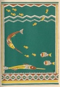

  
[Intangible Textual Heritage](../../../index)  [Native
American](../../index)  [Southeast](../index)  [Index](index) 
[Previous](wsgr16)  [Next](wsgr18) 

------------------------------------------------------------------------

*When the Storm God Rides*, by Florence Stratton, collected by Bessie M.
Reid \[1936\], at Intangible Textual Heritage

------------------------------------------------------------------------

p. 87

### Grandmother River's Trick

Once the little fish that lived in a river, who was their grandmother,
were in danger of being eaten by the garfish. The garfish, because they
were long and slim, could catch the little fish without trouble. When
the little fish fled through the water and tried to hide near the edges
of banks and in shallow places of the river the long garfish darted
after them, poked their slim snouts into the hiding places of the small
fish and snapped them up in their sharp teeth. The hungry garfish were
everywhere. They ate and ate but were never filled. They swam after the
little fish day and night, churned up the river mud and gave the little
fish no rest.

p. 88

The little ones at last cried out to their grandmother, who was the
river, to do something to help them. Grandmother River did not like the
garfish, and she liked the little perch, the bass and the minnows. She
decided to play a trick on the big, hungry fish. She called to a big
cloud that floated over her to send down some of its rain. The cloud
heard. Twisting its dark, wet hair it sent down the rain in a great
flood upon the river.

As the rain began pouring into Grandmother River she began to grow
larger. She grew until she rose out of her banks and poured over the dry
land. When the garfish saw what was happening they thought that here was
a good chance to swim out upon the bushes and see if they

[  
Click to enlarge](img/08800.jpg)

p. 89

could find something more they could eat. Instead of staying between the
banks of the river with the little fish the garfish began to poke their
noses into places where they had no business to be. They swam under the
trees and the bushes and rolled their greedy eyes up at the grasshoppers
and beetles.

And now Grandmother River played her trick. Quickly she gathered up her
skirts to her knees and began running down to the sea, and as she ran
she began dropping along her banks the dirt and sand she was carrying.
Before the garfish saw what she was doing she had built up the banks
higher than ever and had left them in little pools by themselves.

What a rage they were in when they

p. 90

saw how they had been fooled! They leaped in the air, they churned the
pools, and they bit at one another. But it was no use. Grandmother River
just gurgled along in her banks and the little fish played around as
they pleased, happy to be safe from the sharp teeth and hungry mouths of
the garfish.

------------------------------------------------------------------------

[Next: Why Hummingbirds Drink Only Dew](wsgr18)
