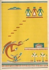

  
[Intangible Textual Heritage](../../../index)  [Native
American](../../index)  [Southeast](../index)  [Index](index) 
[Previous](wsgr27)  [Next](wsgr29) 

------------------------------------------------------------------------

*When the Storm God Rides*, by Florence Stratton, collected by Bessie M.
Reid \[1936\], at Intangible Textual Heritage

------------------------------------------------------------------------

p. 162

### Maidens Who Broke a Drouth

For many days a tribe of Indians had suffered from a drouth that
threatened never to end. The grass dried up. Berry bushes turned yellow
and died as the hot sun kept burning down through the cloudless sky. The
creeks ran dry and the fish died. Animals fled from the country because
there was no more water to be found. Finally the Indians moved their
camp and hunted for water, but nowhere could they find enough. Something
had to be done. The chief of the tribe called on the medicine man to
tell them what they could do to break the drouth and to bring down the
rain once more.

p. 163

Pointing to a high cliff the medicine man told the chief that a great
serpent, the chief of all the snakes, had his den in a cave at the foot
of the cliff. This serpent, said the medicine man, would have to be fed
some of the maidens of the tribe. Then the gods would send down the
rain.

As soon as they learned what the medicine man had said the young girls
hurried to the chief and begged him to let them be thrown over the cliff
to the chief of the snakes, so that their people could have the water
they needed. All Indians were taught to be willing to give up their
lives, if need be, for the sake of the tribe. Because they had been
taught this the young Indian girls were

p. 164

not afraid to die, for they knew that their spirits would be taken up in
the sky by their ancestors and honored for the good they had done their
people. The chief was sad to lose the maidens of the tribe, but he
thought the long drouth could be broken in no other way.

At last the girls who were to be thrown over the cliff to feed the chief
of the snakes were chosen by lot and taken to the top of the cliff. The
medicine man lined them up at the edge. They looked over and became
dizzy when they saw how far it was to the bottom, where lay cruel rocks.
But the maidens were brave. They waited for the medicine man to give
them the signal to leap. When the medicine man had finished his

[  
Click to enlarge](img/16400.jpg)

p. 165

dance and his prayers he raised his hand. Hand in hand the maidens
jumped. Down, down, down they fell, their white robes fluttering. The
parents of the girls turned their faces away, for they could not bear to
see their daughters die.

But the brave Indian girls never died. They never dashed on the rocks.
The goddess who watched over young girls was looking down from the sky
and took pity on the maidens. Just before they reached the bottom of the
cliff she turned them into white flowering bushes which took root on the
spot. As the snake chief, who had been looking up and waiting with an
open mouth for the maidens, saw this happen he was afraid, for he knew
that some power greater than himself

p. 166

had been at work. He hurried back into his dark cave. As soon as he had
gone the clouds which had been afraid to float over the land as long as
the serpent was there now sailed back. Rain poured down from them and
the long drouth was ended.

The bushes which had been the Indian maidens continued to grow and to
spread in memory of the brave deed of long ago. We call these the bee
brush or bush honeysuckle. They still grow in the canyons or gulches,
all over central Texas and southward to the Rio Grande river. All summer
they bloom and fill the air with fragrance. In the spring the plants are
sought by hungry hummingbirds who sometimes nest in them. The bees

p. 167

come to gather honey from the flowers. Butterflies and moths hover over
them. Perhaps these creatures know the story of the sweet-smelling bush.

------------------------------------------------------------------------

[Next: Why Arrows Have Feathers](wsgr29)
