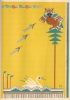

  
[Intangible Textual Heritage](../../../index)  [Native
American](../../index)  [Southeast](../index)  [Index](index) 
[Previous](wsgr29)  [Next](wsgr31) 

------------------------------------------------------------------------

*When the Storm God Rides*, by Florence Stratton, collected by Bessie M.
Reid \[1936\], at Intangible Textual Heritage

------------------------------------------------------------------------

p. 171

### The Cottonwood Remembers

When April comes to stir the forests and fields into new life after the
winter months have gone, the cottonwood tree spreads her arms and shakes
her head and sends her white feathers floating down in the air. The
cottonwood does this every year because she remembers something that
happened long ago before the owl became a wicked bird who eats others.

In the beginning of things no bird killed another. All ate buds and
leaves and grasses. The Great Spirit who made them, caused the birds to
eat these things because he did not like to see anything that he had
made killed by another creature.

p. 172

The owl, at that long distant time, was not blind in the daylight, like
he is now. He flew around with the other birds and fell in love with a
white swan. She could swim. She liked to float on the waters of the
river and to gaze at herself in the smooth water. But the owl was not
made for swimming. He sat in a tree above the swan and wished he could
be with her.

"Marry me, lovely swan," called out the owl one day as he watched her.

The white swan looked up at him and said, "Come down and we shall talk
about it."

The owl was afraid of the water, but he was so much in love with the
swan that he decided he would try it. So down,

[  
Click to enlarge](img/17200.jpg)

p. 173

down he sailed from the limb. He struck the river with a splash. He
tried to swim but he could not. He fluttered his wings and stirred up
the water and scared the fish, but he could not swim. With his mouth
full of water the owl at last rose from the river and flew up to the
branch again. There he sat, dripping water and saying bad words.

"Ha, ha, ha!" came a laugh from the reeds along the river. The loon, a
bird that swims under the water, had seen the owl try to swim and was
laughing at him from behind the reeds. "Ha, ha, ha!" laughed the
long-necked loon again. "The oldest fools are the biggest fools."

That made the wet owl angry. "Who, who, who?" he called out. He was full

p. 174

of rage, and his hooked beak snapped.

On the branch of the cottonwood tree on which the owl was sitting a wood
pigeon was talking to her mate. The wood pigeons didn't know anything
about the owl for they were busy talking. The husband asked, "Whom do
you love?" Just as the owl cried out, "Who, who, who?" the pigeon's mate
said to her husband, "You, you."

When the angry owl heard this he thought the pigeon was talking to him.
Down he darted in a fury towards the limb on which the pigeons were
sitting, and he struck the little pigeon with his strong claws and his
heavy beak. He knocked some fluffy feathers from the poor pigeon as he
caught her. The feathers

p. 175

floated down and brushed the cheek of the Great Spirit as he was walking
by under the trees.

"What is this?" cried the Great Spirit. "Some bird is killed." He looked
up at the cottonwood and saw the owl sitting on a limb with the little
pigeon in one of his cruel claws.

"What has happened?" called out the Great Spirit.

The owl would not answer, but the loon laughed again and told about the
owl and the swan and the pigeons.

Full of rage the Great Spirit decided to punish the owl. He waved his
hand and the owl became blind when the sun was shining and the other
birds were flying around. And so it happened that from

p. 176

that time the owl could not see except at night, when the other birds
were hidden away from his cruel claws and beak. Now the owl flies only
at night. He keeps calling "Who, who?" but nobody answers. The Great
Spirit also punished the loon for laughing. He made the loon swim by
himself on the rivers at night and laugh when the owl calls out.

The cottonwood tree remembers what happened that April day. Because she
remembers how the little gray feathers of the pigeon floated down she
always shakes out her own down. When the winds blew this through the
forest and over the rivers the Indians used to say, "The spirit of the
pigeon has come back to her husband."

------------------------------------------------------------------------

[Next: Why the Skunk Walks Alone](wsgr31)
