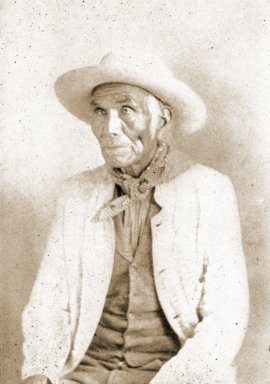

  
[Intangible Textual Heritage](../../../index)  [Native
American](../../index)  [Southwest](../index) 

------------------------------------------------------------------------

<table width="75%">
<colgroup>
<col style="width: 50%" />
<col style="width: 50%" />
</colgroup>
<tbody>
<tr class="odd">
<td data-valign="CENTER" width="50%"></td>
<td data-valign="CENTER" width="50%"><h1 id="aw-aw-tam-indian-nights" data-align="CENTER">Aw-aw-tam Indian Nights</h1>
<h5 id="the-myths-and-legends-of-the-pimas" data-align="CENTER">The Myths and Legends of the Pimas</h5>
<h2 id="by-j.-william-lloyd" data-align="CENTER">by J. William Lloyd</h2>
<h4 id="section" data-align="CENTER">[1911]</h4></td>
</tr>
</tbody>
</table>

------------------------------------------------------------------------

This is a rare book of Pima folklore, transcribed by a sympathetic
amateur ethnographer at the beginning of the twentieth century. The Pima
live in the arid deserts of southern Arizona, and originally survived by
horticulture and hunting/gathering. Lloyd was not a linguist, and
collected the stories through an interpreter. All of the Pima words and
phrases are written using a crude 'phonetic' system, which no doubt is
fairly inaccurate. However, this does not invalidate the folklore, which
is well-told and consistent with other southwestern Native American
mythology, particularly in its repetition of the number four.

------------------------------------------------------------------------

[Title Page](ain00)  
[Author's Errata](ain01)  
[The Story of these Stories](ain02)  

### Stories of the First Night

[The Traditions Of The Pimas](ain03)  
[The Story of the Creation](ain04)  
[Juhwerta Mahkai's Song of Creation](ain05)  
[Notes on Story of Creation](ain06)  
[The Story of the Flood](ain07)  
[Songs](ain08)  
[Notes on the Story of the Flood](ain09)  
[The Story Of Ah-ahn-he-eat-toe-pahk Mahkai](ain10)  
[Notes on the Story of Ah-ahn-he-eat-toe-pahk Mahkai](ain11)  
[The Story of Vandaih, The Man-Eagle](ain12)  
[Notes on the Story of Vandaih](ain13)  

### Stories of the Second Night

[The Story of the Turquoises and the Red Bird](ain14)  
[Notes on the Story of the Turquoises](ain15)  
[The Story of Wayhohm, Toehahvs and Tottai](ain16)  
[Notes on the Story of Wayhohm](ain17)  
[The Story of Hawawk](ain18)  
[Notes on the Story of Hawawk](ain19)  
[The Story of Tawquahdahmawks and her Canal](ain20)  
[Notes on the Story of Tawquahdahmawks](ain21)  
[How Nooee Killed Ee-Ee-Toy](ain22)  
[Songs](ain23)  
[Notes on How Nooee Killed Ee-Ee-Toy](ain24)  
[Ee-Ee-Toy's Resurrection and Speech to Juhwerta Mahkai](ain25)  
[Notes On Ee-ee-toy's Resurrection](ain26)  

### Stories of the Third Night

[The Story Of Ee-ee-toy's Army](ain27)  
[Songs](ain28)  
[The Destruction of the Vahahkkees](ain29)  
[Songs](ain30)  
[Notes on the Story of Ee-Ee-Toy's Army and that of the Destruction of
the Vahakkees](ain31)  
[The Story of Sohahnee Mahkai and Kawkoinpuh](ain32)  
[Notes on the Story of Sohahnee Mahkai](ain33)  
[The Story Of Pahtahnkum](ain34)  
[The Song of Koelhahah About Her Son](ain35)  
[Notes on the Story of Pahtahnkum](ain36)  

### Stories of the Fourth Night

[The Story of the Gambler's War](ain37)  
[Notes on the Story of the Gambler's War](ain38)  
[The Story Of Nahvahchoo](ain39)  
[Notes on the Story of Nahvahchoo](ain40)  
[The Story of Corn and Tobacco](ain41)  
[Notes on the Story of Corn and Tobacco](ain42)  
[The Story of the Children of Cloud](ain43)  
[Notes on the Story of Cloud](ain44)  
[The Story of Tcheunassat Seeven](ain45)  
[Songs](ain46)  
[The Legend of Blackwater](ain47)  
