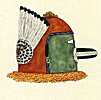
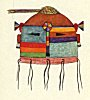
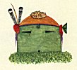
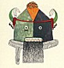
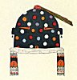

  
[Intangible Textual Heritage](../../../index)  [Native
American](../../index)  [Southwest](../index)  [Index](index) 
[Previous](oma33)  [Next](oma35) 

------------------------------------------------------------------------

### PLATE 1

Acoma katsinas

[  
Click to enlarge](img/pl01a.jpg)  
PLATE 1, Upper Left  

UPPER LEFT: Morityema, ruler of West Mountain. Eagle-feather prayer
stick and topknot of parrot feathers; circle represents a blossom with
colors of the four directions; snout of wood with rabbit fur; collar of
crow feathers. Greenish blue (turquoise) color of West Mountain and of
Spring.

[  
Click to enlarge](img/pl01b.jpg)  
PLATE 1, Upper Right  

UPPER RIGHT: Maiyochina, ruler of South Mountain. Red is the color of
South Mountain; green represents summer crops. (Impersonator looks
through the mouth, not the eyes.) Rabbit fur around snout;
parrot-feather topknot-, turkey-feather rosette with fan of eagle
feathers; owl-feather collar; blue yarn over forehead.

[  
Click to enlarge](img/pl01c.jpg)  
PLATE 1, Center Left  

CENTER LEFT: Oshach Paiyatiuma, Sun Youth. Parrot feathers; three squash
blossoms; median line is the trail over which Sun goes; blue for sky;
striped quarters for the rainbow around Sun; eagle-feather earrings;
buckskin thongs are to fasten a spruce-twig collar.

[  
Click to enlarge](img/pl01d.jpg)  
PLATE 1, Center Right  

CENTER RIGHT: Kuashtoch katsina. Green, the color of mountains; terra
cotta forehead and back; two eagle feathers, one parrot feather; squash
blossom of gourd or yarn; blue yarn on forehead with abalone shell
pendant; spruce collar.

[  
Click to enlarge](img/pl01e.jpg)  
PLATE 1, Lower Left  

LOWER LEFT: Tsitsanits, Katsina chief. Green for sky; yellow for earth;
black for night; topknot of breast feathers of parrot (every katsina has
this); at back, eagle feathers spread out like an eagle's tail; horns of
wood to represent buffalo horns; red yarn; eyes are balls of stuffed
buckskin painted white; slits under the eyes for the impersonator to
look through; teeth of corn husks; beard of human hair; fox-fur collar.

[  
Click to enlarge](img/pl01f.jpg)  
PLATE 1, Lower Right  

LOWER RIGHT: Shuracha, Corn clan katsina. Black because he is a fire
maker and is smoked up; spots are the direction colors; turquoise
earrings; cotton sash (paniu) around neck; designs suggest katsina
heads. (Since the katsina are secret, they do not picture them entirely.
Here only the shape of the head is indicated; in pls. 11, figs. 2, a,
and 6; fig. 2 only the eyes.)

------------------------------------------------------------------------

[Next: Plate 2](oma35)
