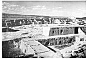

  
[Intangible Textual Heritage](../../../index)  [Native
American](../../index)  [Southwest](../index)  [Index](index) 
[Previous](oma34)  [Next](oma36) 

------------------------------------------------------------------------

### PLATE 2

[  
Click to enlarge](img/pl02.jpg)  
Plate 2  

Acoma, viewed from the roof of the Convento.

------------------------------------------------------------------------

[Next: Plate 3](oma36)
