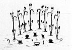
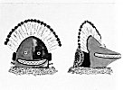

  
[Intangible Textual Heritage](../../../index)  [Native
American](../../index)  [Southwest](../index)  [Index](index) 
[Previous](oma35)  [Next](oma37) 

------------------------------------------------------------------------

### PLATE 3

[  
Click to enlarge](img/pl03a.jpg)  
Plate 3, Figure 1  

FIGURE 1. Antelope clan altar. Oak crooks (brown) with eagle feathers
(white with black tips); turkey feathers (white with black tips) on end
of hook; masks, left to right--(1st) Shuma’ashkă (face green, rest
brown); (2nd) Ahote (black, ears blue); (3d) Gomaiowish (brown on green
base); (4th) Kuashtoch (face blue, features and cap black, base green);
(5th) Gaupakta (brown with green cap); medicine bowl (outside brown with
black edge, inside white with brown lines); stone points (gray).

p. 119

[  
Click to enlarge](img/pl03b.jpg)  
Plate 3, Figure 2  

FIGURE 2. Shakak, ruler of North Mountain. Crest of eagle feathers
(white with black tips); blue for sky (right side of mask); yellow for
earth (left side of mask); collar (light brown) and rosette (black and
white) of owl feathers. Mouth outlined in green.

------------------------------------------------------------------------

[Next: Plate 4](oma37)
