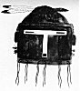
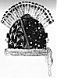

  
[Intangible Textual Heritage](../../../index)  [Native
American](../../index)  [Southwest](../index)  [Index](index) 
[Previous](oma36)  [Next](oma38) 

------------------------------------------------------------------------

### PLATE 4

[  
Click to enlarge](img/pl04a.jpg)  
Plate 4, Figure 1  

FIGURE 1. Shruisthia, ruler of East Mountain. Eagle-feather prayer stick
(black and white); parrot-feather topknot (red and green); blue yarn
over forehead ending on either side in brown earrings, with tassels of
turkey feathers, blue tipped; mask, black (for night); and white (for
the East); lower edge brown.

[  
Click to enlarge](img/pl04b.jpg)  
Plate 4, Figure 2  

FIGURE 2. Tsiukiri, father of the Kopishtaiya. Turkey feathers (gray
with white and black tips) as earrings and back of mask; parrot-feather
topknot (green and red); slanting line (red) represents the direction of
the southeast that Tsiukiri followed when sent away by Iatiku; the short
line joining it (red) is the straight East-West direction; the spots
(green, red, blue, orange, and white) are direction colors; the
background is black because the Kopishtaiya are night spirits; turkey
tracks (white) in the snow make it easier to track the turkeys, so are
lucky; fox-fur collar (gray); eyes and mouth outlined in red.

------------------------------------------------------------------------

[Next: Plate 5](oma38)
