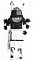
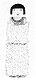
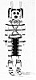

  
[Intangible Textual Heritage](../../../index)  [Native
American](../../index)  [Southwest](../index)  [Index](index) 
[Previous](oma37)  [Next](oma39) 

------------------------------------------------------------------------

### PLATE 5

[  
Click to enlarge](img/pl05a.jpg)  
Plate 5, Figure 1  

FIGURE 1. Kuapichani katsina. Wearing full katsina costume; eagle
feathers (white with black tips), stick (black) with humming bird (red);
parrot-feather topknot (red and green); ears (brown) painted as usual
the color of the forehead (brown); spruce collar (green); turquoise
earrings; abalone-shell pendant; coral necklaces (red); black torso and
white lower body represent night and day; arm bands of buckskin with
spruce (green); green buckskin belt; kashpa (black and white),
ceremonial sash with tassels; hotsini (white with black border), cotton
kilt; in right hand gourd rattle (quartered in orange, red, green,
blue); in left hand flute (striped red and white with zigzag design in
green, black, and white) with gourd (center, orange with cross; edge,
white with green design) on the end; garters (blue) with turtle-shell
rattle (brown); moccasins of buckskin (white with red toes).

[  
Click to enlarge](img/pl05b.jpg)  
Plate 5, Figure 2  

FIGURE 2. Hachamoni kaiok (broken prayer stick). The face (yellow, hair
black with white feather on top) represents Iatiku; the feathers are
eagle down, and under them is cotton; body brown; first necklace,
shells; second, coral; third, coral beads with three abalone-shell
pendants.

[  
Click to enlarge](img/pl05c.jpg)  
Plate 5, Figure 3  

FIGURE 3. Koshari. Hair (black) tied with corn husks (yellow); earrings
(black) of lizards; necklaces of dried apples (brown) and of rabbit skin
(white and black); shoulder straps, bracelets, and anklets of spruce
(green); girdle of buffalo-hoof rattles (black); turtle-shell rattles
(white with black markings) on knees (ordinarily they are worn behind
the leg but Koshari wears them wrong in front); feet painted (in black)
to represent moccasins.

------------------------------------------------------------------------

[Next: Plate 6](oma39)
