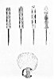

  
[Intangible Textual Heritage](../../../index)  [Native
American](../../index)  [Southwest](../index)  [Index](index) 
[Previous](oma45)  [Next](oma47) 

------------------------------------------------------------------------

### PLATE 13

[  
Click to enlarge](img/pl13a.jpg)  
Plate 13, Figure 1  

FIGURE 1. Maiden's hair frame (design in green, red, blue, yellow,
white), Koshari prayer sticks; from left to right: 1st, face and body
pink, scallops blue, top piece yellow, stick brown; 2nd, face and body
yellow, scallops green, top piece blue and green; 3d, face yellow, body
pink, scallops purple, stick brown; 4th, face white, top piece yellow,
front design green, sides blue and yellow, stick brown.

[  
Click to enlarge](img/pl13b.jpg)  
Plate 13, Figure 2  

FIGURE 2. Objects on Kapina society altar. Tsamaiya (Tiamuni). Yucca
blades (hatuni) for whipping (green). Bowl (white outside, brown inside)
for sacred corn meal with design of the four Mountains of the color
directions (yellow, blue, red).

------------------------------------------------------------------------

[Next: Plate 14](oma47)
