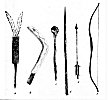
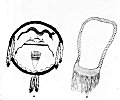

  
[Intangible Textual Heritage](../../../index)  [Native
American](../../index)  [Southwest](../index)  [Index](index) 
[Previous](oma48)  [Next](oma50) 

------------------------------------------------------------------------

p. 123

### PLATE 16

[  
Click to enlarge](img/pl16a.jpg)  
Plate 16, Figure 1  

FIGURE 1. Weapons (waiishi) given by Sun to the Twins. *a*, Dart used
before any other weapon; corn cob (brown), large and burned and smoothed
with stone; wood foreshaft (black) with arrowpoint (gray); feathers of
any kind. *b*, Throwing stick (chaipichama), hard wood (brown) with
lightning design (gray). *c*, Club of hard wood (brown), chaitsi
(rabbit-club root). *d*, Otiawani of hard wood (brown). *e*, Arrow of
achĭti wood (brown); eagle feathers (black) and arrowhead (gray) tied
with sinew. *f*, Bow of oak (brown) with sinew back; string of sinew
which is laid out flat, wet, then twisted up.

[  
Click to enlarge](img/pl16b.jpg)  
Plate 16, Figure 2  

FIGURE 2. Shield and pouch of the Twins. *a*, Shield of buffalo hide;
the two-headed water snake (brown) that the Twins killed at the time of
the flood; stone point (tip white, butt yellow, with 2 lines, blue and
red above) that Lightning (red) tried to kill them with, the colors
representing the different kinds of stone points that were used; bottom,
water waves (blue); eagle feathers. *b*, Pouch (light tan).

------------------------------------------------------------------------

[Next: Plate 17](oma50)
