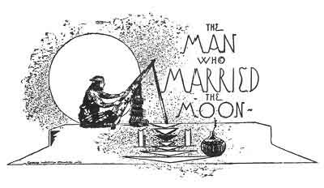
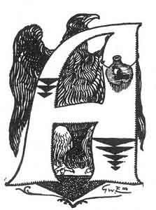
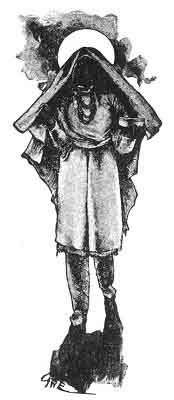
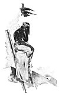

  
[Intangible Textual Heritage](../../../index)  [Native
American](../../index)  [Southwest](../index)  [Index](index) 
[Previous](pifs10)  [Next](pifs12) 

------------------------------------------------------------------------

p. 53

 

# VIII.

### THE MAN WHO MARRIED THE MOON

|                    |
|--------------------|
|  |

MONG the principal heroes of the Tée-wahn folk-lore, I hear of none more
frequently in the winter story-tellings to which my aboriginal neighbors
admit me, than the mighty Nah-chu-rú-chu. To this day his name, which
means "The Bluish Light of Dawn," is deeply revered by the quaint people
who claim him as one of their forefathers. He had no parents, for he was
created by the Trues themselves, and by them was given such
extraordinary powers as were second only to their own. His wonderful

p. 54

feats and startling adventures--as still related by the believing
Isleteños--would fill a volume. One of these fanciful myths has
interested me particularly, not only for its important bearing on
certain ethnological matters, but for its intrinsic qualities as well.
It is a thoroughly characteristic leaf from the legendary lore of the
Southwest.

Long before the first Spaniards came to New Mexico (and *that* was three
hundred and fifty years ago) Isleta stood where it stands to-day--on a
lava ridge that defies the gnawing current of the Rio Grande. [1](#fn_30) In those far days, Nah-chu-rú-chu dwelt in
Isleta, and was a leader of his people. A weaver by trade, [2](#fn_31) his rude loom hung from the dark rafters
of his room; and in it he wove the strong black *mantas* which are the
dress of Pueblo women to this day.

Besides being very wise in medicine, Nah-chu-rú-chu was young, and tall,
and strong, and handsome; and all the girls of the village thought it a
shame that he did not care to take a wife. For him the shyest dimples
played, for him the whitest teeth flashed out, as the owners passed him
in the plaza; but he had no eyes for them. Then, in the naïve custom of
the Tée-wahn, bashful fingers worked wondrous fringed shirts of
buckskin, or gay awl-sheaths, which found their way to his house by
unknown messengers--each as much as

p. 55

to say, "She who made this is yours, if you will have her." But
Nah-chu-rú-chu paid no more attention to the gifts than to the smiles,
and just kept weaving and weaving--such *mantas* as were never seen in
the land of the Tée-wahn before or since.

The most persistent of his admirers were two sisters who were called
*Ee-eh-chóo-ri-ch'áhm-nin*--the Yellow-Corn-Maidens. They were both
young and pretty, but they "had the evil road"--which is the Indian way
of saying that they were possessed of a magic power which they always
used for ill. When all the other girls gave up, discouraged at
Nah-chu-rú-chu's indifference, the Yellow-Corn-Maidens kept coming day
after day, trying to attract him. At last the matter became such a
nuisance to Nah-chu-rú-chu that he hired the deep-voiced town-crier to
go through all the streets and announce that in four days Nah-chu-rú-chu
would choose a wife.

For dippers, to take water from the big earthen *tinajas*, the Tée-wahn
used then, as they use today, queer little ladle-shaped *omates* made of
a gourd; but Nah-chu-rú-chu, being a great medicine-man and very rich,
had a dipper of pure pearl, shaped like the gourds, but wonderfully
precious.

"On the fourth day," proclaimed the crier,

Nah-chu-rú-chu will hang his pearl *omate* at his door, where every girl
who will may throw a handful of corn-meal at it. And she whose meal is
so well ground that it sticks to the *omate*, she shall be the wife of
Nah-chu-rú-chu!"

When this strange news came rolling down the still evening air, there
was a great scampering of

p. 56

little moccasined feet. The girls ran out from hundreds of gray adobe
houses to catch every word; and when the crier had passed on, they ran
back into the store-rooms and began to ransack the corn-bins for the
biggest, evenest, and most perfect ears. Shelling the choicest, each
took her few handfuls of kernels to the sloping *metate*, [1](#fn_32) and

[  
Click to enlarge](img/05600.jpg)  
THE ISLETA GIRLS GRINDING CORN WITH THE ''MANO'' ON THE ''METATE.''  

with the *mano*, or hand-stone, scrubbed the grist up and down, and up
and down, till the hard corn was a soft, blue meal. All the next day,
and the next, and the next, they ground it over and over again, until it
grew finer than ever flour was before; and every girl felt sure that her
meal would stick to the *omate* of the handsome young weaver. The
Yellow-Corn-Maidens worked hardest of all; day and night for four days
they ground and ground, with all the magic spells they knew.

p. 57

Now, in those far-off days the Moon had not gone up into the sky to
live, but was a maiden of Shee-eh-whíb-bak. And a very beautiful girl
she was, though blind of one eye. She had long admired Nah-chu-rú-chu,
but was always too maidenly to try to attract his attention as other
girls had done; and at the time when the crier made his proclamation,

<table data-align="RIGHT">
<colgroup>
<col style="width: 100%" />
</colgroup>
<tbody>
<tr class="odd">
<td data-valign="CENTER"> 
THE MOON-MAIDEN.</td>
</tr>
</tbody>
</table>

she happened to be away at her father's ranch. It was only upon the
fourth day that she returned to town, and in a few moments the girls
were to go with their meal to test it upon the magic dipper. The two
Yellow-Corn-Maidens were just coming from their house as she passed, and
told her of what was to be done. They were very confident of success,
and told the Moon-girl only to pain her; and laughed derisively as she
went running to her home.

By this time a long file of girls was coming to Nah-chu-rú-chu's house,
outside whose door hung the pearl *omate*. Each girl carried in her left
hand a little jar of meal; and as they passed the door one by one, each
took from the jar a handful and threw it against

p. 58

the magic dipper. But each time the meal dropped to the ground, and left
the pure pearl undimmed and radiant as ever.

At last came the Yellow-Corn-Maidens, who had waited to watch the
failure of the others. As they came where they could see Nah-chu-rú-chu
sitting at his loom, they called: "Ah! Here we have the meal that will
stick!" and each threw a handful at the *omate*. But it did not stick at
all; and still from his seat Nah-chu-rú-chu could see, in that
mirror-like surface, all that went on outside.

The Yellow-Corn-Maidens were very angry, and instead of passing on as
the others had done, they stood there and kept throwing and throwing at
the *omate*, which smiled back at them with undiminished luster.

Just then, last of all, came the Moon, with a single handful of meal
which she had hastily ground. The two sisters were in a fine rage by
this time, and mocked her, saying:

"Hoh! *P'áh-hlee-oh*, [1](#fn_33) you poor
thing, we are very sorry for you! Here we have been grinding our meal
four days and still it will not stick, and you we did not tell till
to-day. How, then, can you ever hope to win Nah-chu-rú-chu? Pooh, you
silly little thing!"

But the Moon paid no attention whatever to their taunts. Drawing back
her little dimpled hand, she threw the meal gently against the pearl
*omate*, and so fine was it ground that every tiniest bit of it clung to
the polished shell, and not a particle fell to the ground.

p. 59

 

[  
Click to enlarge](img/05900.jpg)  
THE YELLOW-CORN-MAIDENS THROWING MEAL AT THE ''OMATE''  

 

p. 61

When Nah-chu-rú-chu saw that, he rose up quickly from his loom and came
and took the Moon by the hand, saying, "You are she who shall be my
wife. You shall never want for anything, since I have very much." And he
gave her many beautiful *mantas*, and cotton wraps, and fat boots of
buckskin that wrap round and round, that she might dress as the wife of
a rich chief. But the Yellow-Corn-Maidens, who had seen it all, went
away vowing vengeance on the Moon.

Nah-chu-rú-chu and his sweet Moon-wife were very happy together. There
was no other such housekeeper in all the pueblo as she, and no other
hunter brought home so much buffalo-meat from the vast plains to the
east, nor so many antelopes, and black-tailed deer, and jack-rabbits
from the Manzanos as did Nah-chu-rú-chu. But he constantly was saying to
her:

"Moon-wife, beware of the Yellow-Corn-Maidens, for they have the evil
road and will try to do you harm, but you must always refuse to do
whatever they propose." And always the young wife promised.

One day the Yellow-Corn-Maidens came to the house and said:

"Friend Nah-chu-rú-chu, we are going to the *llano* [1](#fn_34) to gather *amole*. [2](#fn_35) Will you not let your wife go with us?"

"Oh, yes, she may go," said Nah-chu-rú-chu; but taking her aside, he
said, "Now be sure that you refuse whatever they may propose."

p. 62

The Moon promised, and started away with the Yellow-Corn-Maidens.

In those days there was only a thick forest of cottonwoods where are now
the smiling vineyards, and gardens, and orchards of Isleta, and to reach
the *llano* the three women had to go through this forest. In the very
center of it they came to a deep *pozo*--a square well, with steps at
one side leading down to the water's edge.

"Ay!" said the Yellow-Corn-Maidens, "how hot and thirsty is our walk!
Come, let us get a drink of water."

But the Moon, remembering her husband's words, said politely that she
did not wish to drink. They urged in vain, but at last, looking down
into the *pozo*, called:

"Oh, Moon-friend! Come and look in this still water, and see how pretty
you are!"

The Moon, you must know, has always been just as fond of looking at
herself in the water as she is to this very day, and forgetting
Nah-chu-rú-chu's warning, she came to the brink, and looked down upon
her fair reflection. But at that very moment, the two witch-sisters
pushed her head foremost into the *pozo*, and drowned her; and then
filled the well with earth, and went away as happy as wicked hearts can
be.

 

Nah-chu-rú-chu began to look oftener from his loom to the door as the
sun crept along the adobe floor, closer and closer to his seat; and when
the shadows were very long, he sprang suddenly to his feet, and walked
to the house of the Yellow-Corn-Maidens with long, strong strides.

p. 63

"*Ee-eh-chóo-ri-ch'áhm-nin*," he said, very sternly, "where is my little
wife?"

"Why, is n't she at home?" asked the wicked sisters as if in great
surprise. "She got enough *amole* long before we did, and started home
with it. We supposed she had come long ago."

"Ah," groaned Nah-chu-rú-chu within himself; "it is as I thought--they
have done her ill." But without a word to them he turned on his heel and
went away.

From that hour all went ill with Isleta, for Nah-chu-rú-chu held the
well-being of all his people, even unto life and death. Paying no
attention to what was going on about him, he sat motionless upon the
very crosspiece of the *estufa* ladder--the highest point in all the
town--with his head bowed upon his hands. There he sat for days, never
speaking, never moving. The children that played along the streets
looked up to the motionless figure, and ceased their boisterous play.
The old men shook their heads gravely, and muttered: "We are in evil
times, for Nah-chu-rú-chu is mourning, and will not be comforted. And
there is no more rain, so that our crops are drying in the fields. What
shall we do?"

At last all the councilors met together, and decided that there must be
another effort made to find the lost wife. It was true that the great
Nah-chu-rú-chu had searched for her in vain, and the people had helped
him; but perhaps some one else might be more fortunate. So they took
some of the sacred smoking-weed wrapped in a corn-husk and went to
Shée-wid-deh, who has the sharpest

p. 64

eyes in all the world. Giving him the sacred gift they said:

"Eagle-friend, we see Nah-chu-rú-chu in great trouble, for he has lost
his Moon-wife. Come, search for her, we pray you, if she be alive or
dead."

So the Eagle took the offering, and smoked the smoke-prayer; and then he
went winging upward into the very sky. Higher and higher he rose, in
great upward circles, while his keen eyes noted every stick, and stone,
and animal on the face of all the world. But with all his eyes, he could
see nothing of the lost wife; and at last he came back sadly, and said:

"People-friends, I went up to where I could see the whole world, but I
could not find her."

Then the people went with an offering to the Coyote, whose nose is
sharpest in all the world; and besought him to try to find the Moon. The
Coyote smoked the smoke-prayer, and started off with his nose to the
ground, trying to find her tracks. He trotted all over the earth; but at
last he too came back without finding what he sought.

Then the troubled people got the Badger to search, for he is best of all
the beasts at digging--and he it was whom the Trues employed to dig the
caves in which the people first dwelt when they came to this world. The
Badger trotted and pawed, and dug everywhere, but he could not find the
Moon; and he came home very sad.

Then they asked the Osprey, who can see farthest under water, and he
sailed high above all the lakes and rivers in the world, till he could
count the

p. 65

 

[  
Click to enlarge](img/06500.jpg)  
THE GRIEF OF NAH-CHU-RÚ-CHU.  

 

p. 67

pebbles and the fish in them, but he too failed to discover the lost
Moon.

By now the crops were dead and sere in the fields, and thirsty animals
walked crying along the dry river. Scarcely could the people themselves
dig deep enough to find so much water as would keep them alive. They
were at a loss which way to turn; but at last they thought: We will go
to P'ah-kú-ee-teh-áy-deh, [1](#fn_36) who can
find the dead--for surely she is dead, or the others would have found
her.

So they went to him and besought him. The Turkey-buzzard wept when he
saw Nah-chu-rú-chu still sitting there upon the ladder, and said: "Truly
it is sad for our great friend; but for me, I am afraid to go, since
they who are more mighty than I have already failed; but I will try."
And spreading his broad wings he went climbing up the spiral ladder of
the sky. Higher he wheeled, and higher, till at last not even the Eagle
could see him. Up and up, till the hot sun began to singe his head, and
not even the Eagle had ever been so high. He cried with pain, but still
he kept mounting--until he was so close to the sun that all the feathers
were burned from his head and neck. But he could see nothing; and at
last, frantic with the burning, he came wheeling downward. When he got
back to the *estufa* where all the people were waiting, they saw that
his head and neck had been burnt bare of feathers--and from that day to
this the feathers would never grow out again.

"And did you see nothing?" they all asked, when they had bathed his
burns.

p. 68

"Nothing," he answered, "except that when I was half-way down I saw in
the middle of yon cottonwood forest a little mound covered with all the
beautiful flowers in the world."

"Oh!" cried Nah-chu-rú-chu, speaking for the first time. "Go, friend,
and bring me one flower from the very middle of that mound."

Off flew the Buzzard, and in a few minutes returned with a little white
flower. Nah-chu-rú-chu took it, and descending from the ladder in
silence, walked to his house, while all the wondering people followed.

When Nah-chu-rú-chu came inside his home once more, he took a new
*manta* and spread it in the middle of the room; and laying the wee
white flower tenderly in its center, he put another new *manta* above
it. Then, dressing himself in the splendid buckskin suit the lost wife
had made him, and taking in his right hand the sacred *guaje* (rattle),
he seated himself at the head of the *mantas* and sang:

"*Shú-nah, shú-nah!  
Aí-ay-ay, aí-ay-ay, aí-ay-ay!*"

(Seeking her, seeking her!  
There-away, there-away!)

When he had finished the song, all could see that the flower had begun
to grow, so that it lifted the upper *manta* a little. Again he sang,
shaking his gourd; and still the flower kept growing. Again and again he
sang; and when he had finished for the fourth time, it was plain to all
that a human form lay between the two *mantas*. And

p. 69

when he sang his song the fifth time, the form sat up and moved.
Tenderly he lifted away the over-cloth, and there sat his sweet
Moon-wife, fairer than ever, and alive as before! [1](#fn_37)

For four days the people danced and sang in the public square.
Nah-chu-rú-chu was happy again; and now the rain began to fall. The
choked earth drank and was glad and green, and the dead crops came to
life.

When his wife told him how the witch-sisters had done, he was very
angry; and that very day he made a beautiful hoop to play the
*mah-khúr*. He painted it, and put strings across it, decorated with
beaded buckskin.

"Now," said he, "the wicked Yellow-Corn-Maidens will come to
congratulate you, and will pretend not to know where you were. You must
not speak of that, but invite them to go out and play a game with you."

In a day or two the witch-sisters did come, with deceitful words; and
the Moon invited them to go out and play a game. They went up to the
edge of the *llano*, and there she let them get a glimpse of the pretty
hoop.

"Oh, give us that, Moon-friend," they teased. But she refused. At last,
however, she said:

"Well, we will play the hoop-game. I will stand here, and you there; and
if, when I roll it to you, you catch it before it falls upon its side,
you may have it."

p. 70

So the witch-sisters stood a little way down the hill, and she rolled
the bright hoop. As it came trundling to them, both grasped it at the
same instant; and lo! instead of the Yellow-Corn-Maidens, there were two
great snakes, with tears rolling down ugly faces. The Moon came and put
upon their heads a little of the pollen of the corn-blossom (still used
by Pueblo snake-charmers) to tame them, and a pinch of the sacred meal
for their food.

"Now," said she, "you have the reward of treacherous friends. Here shall
be your home among these rocks and cliffs forever, but you must never be
found upon the prairie; and you must never bite a person. Remember you
are women, and must be gentle."

And then the Moon went home to her husband, and they were very happy
together. As for the sister snakes, they still dwell where she bade
them, and never venture away; though sometimes the people bring them to
their houses to catch the mice, for these snakes never hurt a person.

------------------------------------------------------------------------

### Footnotes

[54:1](pifs11.htm#fr_30) Bandelier has published
a contrary opinion, to which I do not think he would now cling. The
folk-lore and the very name of the town fully prove to me that its site
has not changed in historic times.

[54:2](pifs11.htm#fr_31) In the ancient days,
weaving was practised only by the men, among the Pueblos. This old usage
is now reversed, and it is the women who weave, except in the pueblos
Moqui.

[56:1](pifs11.htm#fr_32) The slab of lava which
still serves as a hand-mill in Pueblo houses.

[58:1](pifs11.htm#fr_33) Tée-wahn name of the
moon; literally, "Water-Maiden."

[61:1](pifs11.htm#fr_34) Plain.

[61:2](pifs11.htm#fr_35) The soapy root of the
palmilla, used for washing.

[67:1](pifs11.htm#fr_36) Turkey-buzzard;
literally, "water-goose-grandfather."

[69:1](pifs11.htm#fr_37) Nah-chu-rú-chu's
incantation followed the exact form still used by the Indian conjurors
of the Southwest in their wonderful trick of making corn grow and mature
from the kernel in one day.

------------------------------------------------------------------------

[Next: IX. The Mother Moon](pifs12)
