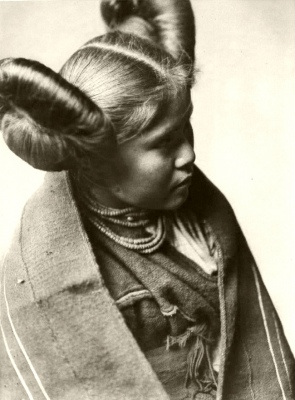

  
[Intangible Textual Heritage](../../../index)  [Native
American](../../index)  [Southwest](../index) 

------------------------------------------------------------------------

<table width="75%">
<colgroup>
<col style="width: 50%" />
<col style="width: 50%" />
</colgroup>
<tbody>
<tr class="odd">
<td width="50%" data-valign="TOP"></td>
<td width="50%" data-valign="CENTER"><h1 id="songs-of-the-tewa" data-align="CENTER">Songs of the Tewa</h1>
<h2 id="tr.-by-herbert-joseph-spinden" data-align="CENTER">tr. by Herbert Joseph Spinden</h2>
<h4 id="section" data-align="CENTER">[1933]</h4></td>
</tr>
</tbody>
</table>

------------------------------------------------------------------------

[Contents](#contents)    [Start Reading](sot00)    [Page
Index](pageidx)    [Text \[Zipped\]](sot.txt.gz)

------------------------------------------------------------------------

This is a collection of poetry of the Tewa. The Tewa are a Pueblo
culture, who live on the Hopi Reservation in Arizona. This monograph
includes translations of a cycle of Tewa poems. An appendix has
interlinear texts for some of the Tewa songs. The book is preceeded by
an essay on Native American poetry and literature, including samples
from the north to the south of the American continent.

------------------------------------------------------------------------

 [Title Page](sot00)  
[Contents](sot01)  
[Author's Preface](sot02)  
[An Essay on American Indian Poetry](sot03)  

### Part I: Home Songs

[Contents](sot04)  
[I. The Road of Magic](sot05)  
[II. That Mountain Far Away](sot06)  
[III. I Wonder How My Home Is](sot07)  
[IV. The Willows by the Water Side](sot08)  
[V. Banter](sot09)  
[VI. Lost Love](sot10)  
[VII. Thamu's Song](sot11)  
[VII. Shadows](sot12)  
[IX. The Inconstant Lover](sot13)  
[X. Disillusion](sot14)  
[XII. Rags Are Royal Raiment . . . . .](sot15)  
[XIII. When the Trading Party Sets Out](sot16)  
[XIV. When the War Party Sets Out](sot17)  
[A Corn Grinding Song of Tesuque](sot18)  
[XVI. The Blue Flower Basket](sot19)  
[XVII. The Rabbit by the River](sot20)  
[XVIII. Rains for the Harvest](sot21)  
[XIX. The Cloud-Flower Lullaby](sot22)  
[XX. A Lullaby of Nambe](sot23)  
[XXI. Lullaby of Cannibal Giants](sot24)  
[XXII. Sleepy Bird Lullaby](sot25)  
[XXIII. Children's Flower Song of Nambe](sot26)  

### Part II. Sacred Chants and Ceremonial Songs

[Contents](sot27)  
[XXIV. Initiation Chant of the Kwirana K’osa](sot28)  
[XXV. Initiation Song of the Tewa K’osa](sot29)  
[XXVI. Lake Song of the Tewa K’osa](sot30)  
[XXVII. How the Gods are Brought](sot31)  
[XXVIII. Uru-Tu-Sendo's Song](sot32)  
[XXIX. Song of the Sky Loom](sot33)  
[XXX. The Corn-Silk-Women's Song](sot34)  
[XXXI. Rain Magic Song](sot35)  
[XXXII. Songs in the Turtle Dance of Nambe](sot36)  
[XXXIII. Songs in the Turtle Dance at Santa Clara](sot37)  
[XXXIV. Songs of the Race Dance](sot38)  
[Song of Avanyu, the Storm Serpent](sot39)  
[XXXVI. Scalp Dance Song](sot40)  

### Part III. Magic Songs and Prayers

[Contents](sot41)  
[XXXVII. That Buffalo May Come](sot42)  
[XXXVIII. Song of the Hunter's Wife](sot43)  
[XXXIX. With Dangling Hands](sot44)  
[XL. When the Deer Come](sot45)  
[XLI. Eagle Song](sot46)  
[XLII. Speech For Good Trading](sot47)  
[XLIII. When the First Fruits Are Taken](sot48)  
[XLIV. When the Corn Mothers Are Fed](sot49)  
[XLV. Prayer For Long Life](sot50)  
[XLVI. When the Child is Named](sot51)  
[XLVII. When the Man Takes Office](sot52)  
[XLVIII. Last Words at the Grave](sot53)  
[XLIX. When the Scalps Are Fed](sot54)  
[L. Dead on the War Path](sot55)  

 

[Appendix](sot56)  
