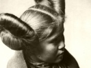

  
[Intangible Textual Heritage](../../../index)  [Native
American](../../index)  [Southwest](../index)  [Index](index) 
[Previous](sot07)  [Next](sot09) 

------------------------------------------------------------------------

  
*Songs of the Tewa*, by Herbert Joseph Spinden, \[1933\], at Intangible
Textual Heritage

------------------------------------------------------------------------

##### IV

##### THE WILLOWS BY THE WATER SIDE

My little breath, under the willows by the water side we used to sit  
And there the yellow cottonwood bird came and sang.  
That I remember and therefore I weep.  
Under the growing corn we used to sit,  
And there the little leaf bird carne and sang.  
That I remember and therefore I weep.  
There on the meadow of yellow flowers we used to walk  
Oh, my little breath! Oh, my little heart!  
There on the meadow of blue flowers we used to walk.  
Alas! how long ago that we two walked in that pleasant way.  
Then everything was happy, but, alas! how long ago.  
There on the meadow of crimson flowers we used to walk.  
Oh, my little breath, now I go there alone in sorrow.

------------------------------------------------------------------------

[Next: V. Banter](sot09)

