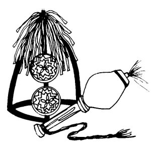
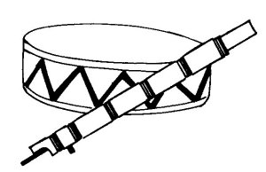
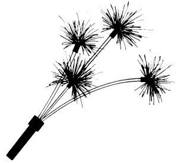
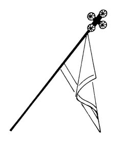

  
[Intangible Textual Heritage](../../../index)  [Native
American](../../index)  [Southwest](../index)  [Index](index) 
[Previous](yml02)  [Next](yml04) 

------------------------------------------------------------------------

p. 5

 

# Cultural Setting

### Language

THE YAQUIS are a Sonoran tribe. They are Cahitan-speaking peoples,
affiliated linguistically with the Tarahumaras, Opatas, Conchos, Mayos,
and other nearby tribes. Aboriginally, the Yaquis and the Mayos occupied
the flood plain areas from the town of Sinaloa north to the pueblo of
Cumuripa on the Yaqui River in Sonora (Sauer 1934: 79). Cahitans are of
the Uto-Aztecan stock. Of the tribes which adjoined the Cahitan
territory to the north, only the Hokan-speaking Seris were not
Uto-Aztecans. On the east, the Cahitans were bordered by the Sonoran
tribes of the foothills. These tribes separated the lowland Cahitans
from the Tarahumaras of the plateau who were also of Uto-Aztecan stock.
On the south, the Cahitan area was bordered by rude, barranca or coastal
tribes such as the Guasave. These were possibly variants, culturally and
linguistically, of the Cahitans. No equal number of people spoke a
single language in northern Mexico (Sauer 1934: 22-28).

p. 6

 

### Brief History

YAQUIS have been in close contact with European culture since the
Spanish conquest of their region by Jesuit missionaries in 1617. The
Spaniards influenced Yaqui religion through the work of the Jesuits, but
they also instigated changes in the material culture and social
organization of the natives. The Indians were gathered from scattered
*rancherías* into eight large pueblos, each with its church at the
center. Governors were appointed by the Spanish and new forms of civil
rule were introduced. For the Yaquis, the period of Jesuit occupation
was one of peaceful acculturation and material development.

In 1767 the Jesuits were expelled from the region. Foreigners exploiting
the riches of the area brought the Yaquis to a state of unrest. The new
Mexican government attempted to tax the Yaqui land. In 1825, Juan
Banderas began a united Indian revolt against the Mexican inhabitants of
the Yaqui region (Troncoso 1905: 112). For six years fighting continued
intermittently and the Yaquis learned the use of fire-arms. Temporarily
they drove out the Mexican settlers.

p. 7

These early victories of the Yaquis can be attributed to the weakness of
the politically disunited Mexican government. As Mexican internal unity
was re-established, war without quarter ensued. This was the beginning
of a century of intermittent strife between Mexicans and Yaquis.

In 1876, the great Yaqui leader, Cajeme, took advantage of Mexican
disunity in Sonora to drive again the Mexican settlers from the Yaqui
valley. When Cajeme was executed by the Mexicans in 1887, another Indian
leader, Juan Maldonado Tetabiate, continued the revolt of his people. As
the strength of the Mexican army increased, Yaquis were forced either
into guerrilla bands in the rugged mountains of the region or into
hiding as laborers on Mexican ranches, in mines, or on the new railroad
which was being built. Indians in hiding secretly sent supplies to their
troops in the hills, and the raiding continued.

In the early 1900's Governor Yzábal of Sonora inaugurated a policy of
deportation against the Yaquis. Captives were sent to Yucatan to work on
henequen plantations. Many executions took place (Calvo 1949: 96).
Peaceful Indians suspected of helping the raiders were hunted out. Many
were killed and families were separated. This caused a great reduction
in the numbers and efficiency of forces in the mountains, since their
source of ammunition was cut off. Mexican settlers filtered back into
the Yaqui valley under protection of Mexican troops (Spicer 1943a: 23).

However, small bands of Yaquis still fought on until as late as 1927.
Thus, for forty years Yaqui culture was forced into dormancy. A few
Indians were living in the hills and many more were living

p. 8

and working with Mexicans and so were subjected to various foreign
influences. Since 1927 some nine thousand Yaquis have returned to their
region, repopulating many of their old pueblos and following the old way
of life.

In 1937 the Mexican government's attitude changed toward the Indians.
President Cardenas set aside for the Yaquis twenty per cent of their
original territory (Fabila 1940: 194). Here they live today under
Mexican military supervision, although they govern themselves in most
ways.

Since the late 1920's the official Mexican policy has been more friendly
and constructive, aimed toward educating the natives, improving their
material welfare and attempting to break down past social barriers
between Indians and the Mexicans. However, social barriers in the region
are still very real. Slowly, the new policy of contact is inaugurating a
period of acculturation for the Yaquis along lines of directed change.
There has been and promises to be little decay in the traditional
ceremonial life of the Yaquis which has survived the period of
persecution and forms the backbone of Yaqui culture as it is being
practiced today (Spicer 1943a: 28).

 

p. 9

### Environment

THE FEELING among Yaquis, wherever they may be, is that the true center
of their culture is in the eight pueblos which cluster about the mouth
of the Rio Yaqui in Sonora, Mexico. In recent years, five of the eight
pueblos have suffered varying degrees of depopulation. The nine thousand
or so Yaquis in their valley today live mainly in the Pueblos of Potam,
Vicam and Torim. Various small rancherías are scattered along the river,
Some Indians live in all of the traditional eight pueblos except one,
Belen, which is deserted because of a complete lack of water in its
vicinity.

 

### Economy

THE YAQUIS are agricultural. Twice each year floods make the rich,
alluvial land along the river ideal for crop raising. In order to farm,
the river bottom is first cleared of a dense covering of underbrush,
such as *tuna* and *pitahaya*, native bamboo, willow, large mesquite
trees and cottonwood trees. The aboriginal crops of corn, beans, and
squash are supplemented by foods introduced by the Spaniards and
Mexicans. Wheat is grown in quantities enough for export. Cattle,
horses,

p. 10

mules, goats, pigs, and chickens are now an added source of livelihood
(Fabila 1940: 8-33). Some wild foods are gathered from the wilderness
(called *monte* by the natives), such as honey, wild greens, and tubers.
Snares are set for small animals. Larger game abounds in the foothills,
and fish are caught in the Gulf of California.

Nearly all Yaquis live from the land, although the making and selling of
bamboo mats, willow baskets, or wheel-made pottery supplements the
economy. Also an important item in the support of nearly every Sonoran
Yaqui family today is the wages paid every two weeks to most Yaqui men,
as soldiers (Spicer, E. H. and R. B. 1942). This approximates a form of
dole.

The greatest economic drain upon Yaqui families, outside of bare living
costs, appears to be the expense of their ceremonial and religious
obligations (Spicer 1940b: 44-47, 236-237). The fulfillment of all such
ceremonial obligations is of primary importance to the community. In
fact, when religious affairs conflict with farming or some other job,
the job suffers. Since the church governor (*teopo kobanao*) works year
round at official duties and has little time for farming, he is often
supported by the people of the pueblo.

No great extremes exist in regard to wealth, although some are better
off than others.

 

p. 11

 

### The Past

ACCORDING TO what has been reported of Yaqui culture in early times,
they were an agricultural food-gathering and hunting group, living in
rancherías scattered along the lower reaches of the Yaqui River. They
used a wooden mortar in preparation of foods, hunted with bow and arrow
(sometimes poisoned), clubs, and perhaps spears. A carrying yoke was
employed, as it is today. Their clothes were made of skins. Tattooing
and nose and ear-piercing were practiced. They lived in small, scattered
clusters of houses, until the missionaries brought them into eight
larger communities, each centering about a church. Their homes no doubt
resembled the spacious, rectangular units with adjoining ramadas in
which the Yaquis live today.

p. 12

### Social and Ceremonial Patterns

|                    |
|--------------------|
|  |

SPANISH INFLUENCE brought a greater development of agriculture and a
gradual change to European modes of dress. During the last century the
Yaquis adopted the use of fire-arms. The bow is now used only
ceremonially and in hunting, sometimes by children. Lately, some modern
mechanical devices have been adopted in the household, and a few
machines are used in the fields. Some native craft work is still made by
both men and women. Foreign crafts such as wheel-turned pottery and
machine sewing are usual.

TODAY, the Yaqui social and religious patterns are strongly reflective
of the Spanish culture which was imposed from the seventeenth into the
nineteenth centuries. The Yaqui military organization, god-parent
system, and much Catholic tradition and ritual were adopted from the
Spaniards and merged with aboriginal practices to give a distinctive
cast to what, by the late 1800's, was a well-integrated culture. Yaqui
society is different from that of the Mexicans of the region not only
because of its aboriginal aspects but also because it has retained
antiquated traits of seventeenth century Spanish culture.

In Sonora the Yaquis still govern themselves in the old way. Matters of
importance to the pueblo are discussed at a village meeting or council,
called a *junta*. This is attended by the five governors (*kobanaom*),
the ex-governors, or elders (*pueplo yo'owe*), the military society
(*sontaom*), and the church officials and members of ceremonial
societies. This body of civil, military, and

p. 13

religious leaders discusses and decides all matters. Cases involving
people from different pueblos are treated by a joint junta of the
pueblos concerned. Ritual and praying accompany the discussion at these
gatherings. The opinion of the elders is respected. A Yaqui culprit's
punishment may be measured in the lashes of the rawhide whip carried
about the waist of an official called the *alawasin*. The stocks, also
an early Spanish method of punishment, are known to the Yaquis.

The oldest man or woman in the household is considered its head. Often
three generations dwell together in a household, which is the basic unit
of Yaqui society. There is no apparent rule stating whether a newly
married couple should live with the boy's or the girl's parents. The
god-parent relationships, sanctioned by the church, are an important
part of the social structure. These supplement the primary kinship
circle and are a stabilizing factor in the community. These
relationships have been enlarged and specialized by the Yaquis and
provide each person with a wide circle of ceremonial kin with mutual
obligations.

Little is known, from record, of the social 

|                    |
|--------------------|
|  |

and religious life of the Yaquis before Spanish contact. It is
difficult, today, to determine which of their cultural practices are
aboriginal survivals. Spicer suggests similarity between aboriginal
Yaqui social and religious organization and that of the more advanced
Pueblo groups of the Southwest. According to him, survivals in Yaqui
culture indicate the "possibility of patrilineal clan (gens) groups, an
important system of ceremonial societies somewhat similar to those of
the Pueblos, and an elaborate ceremonial calendar and ritual"

p. 14

\[paragraph continues\] (Spicer 1940a: 22). The Yaquis' early kinship
system, which is being partly replaced by the Mexican system, is
considered Yuman in type. The relative age distinctions, evident in
kinship terminology, are still remembered in terms employed for members
of the elementary family. Although Yaqui interpretations of Catholic
ritual surround birth, marriage, and death, often symbols of the earlier
ceremonialism accompany them. The formal structure of aboriginal
ceremony has disintegrated, but fragments of it remain interlaced with
the new Catholicized religious organization.

Since Jesuit times, Yaqui community life has centered about the church.
All village officials, civil and military as well as religious, have
duties in the church. Both religious and social activities are centered
about the events of the Catholic calendar and the performance of the
ceremonies attending birth, confirmation, marriage and death (Spicer
1940b: 104-236, 95-116). These, rites and ceremonies take place both in
the church and the household.

 

------------------------------------------------------------------------

[Next: Yaqui Story Telling](yml04)
