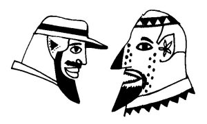
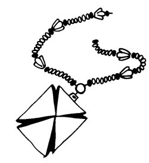

  
[Intangible Textual Heritage](../../../index)  [Native
American](../../index)  [Southwest](../index)  [Index](index) 
[Previous](yml03)  [Next](yml05) 

------------------------------------------------------------------------

p. 15

 

# Yaqui Story Telling

STORY TELLING among the Yaquis today is quite informal. There appears to
be no socially determined time or place for relating the myths or tales
except in the case of *pascola* stories, which are told at fiestas. Nor
are there special persons who are supposed to tell the myths or tales.
Yaquis say that stories are most often told, by men or women, in the
evenings when a group happens to be gathered in the ramada or in the
house by the fire. They also tell stories when working in the fields.
Some of the older Yaquis indicate that story-telling used to be more
formalized in the time of their parents or in their own youth. They also
believe that the folk literature as a whole was more familiar to all
Yaquis in earlier times than it is today. Most of the Indians today know
some myths and tales but no one person was encountered who knows all of
the stories in this collection. The myths or legends and tales which
appear

p. 16

to be of pre-Spanish provenience do not seem to be as widely known and,
in some cases, appear to be only partially remembered fragments of more
complete myth cycles. Even the Jesuit period myths giving origins for
Catholicized ceremonies are not by any means familiar to everybody who
participates in the ritual. It is a general observation that most Yaquis
have slight knowledge of pre-Spanish myths and tales and that a broad
knowledge of these is limited to old people, members of conservative
families, and persons with special interest in the past or in folk
stories. More widely known are the recent myths of warfare, of
traditions which support Yaqui claims against Mexican encroachment upon
their territory, and tales of the Jesuit and more recent periods,
particularly the pascola stories.

The subject matter of myths or legends and tales, the traditional
themes, characters, and beliefs, reflect a society which has been in
contact with foreigners for three centuries. Although many stories show
considerable foreign influence, they are usually given a Yaqui
background familiar to the narrator. The style of wording appears to be
more individual than formal. However, different narrators are often
consistent about the sequence of events. Formal endings are not always
used. Kinship and occupations of characters are frequently mentioned.
Names are usually given. Geography is often related to the action of a
story. Since these characteristics seldom occur in tales of foreign
introduction, and since they are usual in the earliest type of myths and
tales, most often told in the Yaqui language, this may indicate that
such traits are remnants of a formal style of storytelling employed more
commonly in the past.

p. 17

The characters in early Yaqui stories are not elaborately drawn. They
represent the common Yaqui social personality, conception of
supernaturals, and the animals. New characters entered folk traditions
as the Indians became familiar with Bible traditions, European history
and folk stories. Eventually the Catholic pantheon merged with and
partly submerged the aboriginal one; Spaniards, Moors, and the Devil
joined Yaqui historical characters, and rogues, adventure-seekers, and
kings of European folklore became a part of Yaqui folk traditions. The
characterization of heroes reflects changing standards from early times
to the present. For instance, heroes of early tales are often obedient,
wise, powerful, and great leaders or hunters. In Jesuit-period myths and
tales, they become pious or sinful, according to Yaqui-Catholic
standards. More recent stories feature pranksters, merchants, warriors,
or cowboys.

Subject matter may be drawn from traditional and modern tribal belief.
Plots are generally simple, consisting of one or two related incidents.

The pascola story-teller is undoubtedly an aboriginal Yaqui institution.
Today, he is only superficially allied with the Yaqui-Catholic religion
through appearing at religious fiestas, at children's funerals, and as a
dancer on the morning of Holy Saturday. His stories suggest that they
are of an early kind which have changed only as the society about which
they are told has changed.

Yaqui attitudes regarding their folk literature vary. Older persons in
the group learned to know and respect ancient belief during their youth,
from elders and from group influence, before the people were scattered
during the Mexican persecution in the early 1900's. Such older persons

p. 18

and members of conservative families, often those who remained hidden in
the mountains throughout this period, are better acquainted with ancient
tribal traditions and value them more highly. All Yaquis associate their
folk literature not only with entertainment but also with pride in their
history and culture.

Primarily, myths and legends are considered entertaining history and the
tales as pure entertainment. As a body, the folklore is not considered
sacred, although it is associated with native religion and ritual. Some
stories are of social importance because they point a moral.

Much of the history claimed by the Yaquis has been borrowed, but they
consider it their own and do not distinguish between history and
tradition. Recent stories about warfare with the Mexicans demonstrate
the bravery of Yaqui warriors and the justice of their cause. Earlier
legends concerning warfare are told today as expressions of their
feelings about the cruelty or treachery of the Mexicans, or the
superiority of the Yaquis.

Many legends reflect the Yaqui feeling that their region is rightfully
theirs. Tales of ancient heroes or saints defining Yaqui territory in
mythical times are told as proof that the tribe is justified in
defending its land. Ancient myths are set in specific parts of the Yaqui
region, giving significance to the spot where the talking tree stood,
the pueblo where Jesucristo was crucified, or the waterhole to which a
priest condemned an evil monster to live. The origin of the names of
hills is described. The spirits of their ancestors, the Surem, are said
to dwell in the sea, inside

p. 19

of mountains, or in the forms of ants. Other traditions say that
serpents or spirits inhabit certain bodies of water, that the rain is an
evil one-eyed god, and the shooting star a brave dwarf hunter. Animals
are sometimes possessed of magic powers and should be respected. Some
animals are described as culture heroes, such as the *toli* who
introduced the first pascola drum and flute, or the badger who named the
sun. The deer is able to make himself invisible, and snakes take on
human form. The numbers three and four are magical. A special kind of
wood in a bow or an arrow enables a hero to perform great deeds. The
smoking of native tobacco inspires the power of prophecy. Witches have
the ability to take animal forms. Such magical beliefs may appear in
stories from any period, even the present.

Myth cycles about nature deities, animals, and magic were undoubtedly a
part of Yaqui religious practice prior to their contact with the
Jesuits. However, today, any sacred meaning in them has been transferred
to the saints and Catholicized ceremony. Old Yaquis or members of
conservative families still hold to many pre-Christian beliefs about the
supernatural, but such beliefs are considered secular rather than sacred
truths. There is no worship of nature deities. Evidently children today
are not taught such beliefs, for they know little about personifications
of the elements or the powers of the animals.

In a few cases nature deities can be identified with Catholic concepts.
For instance, Yuku is often called the Devil, and Suawaka is sometimes
called San Miguel. This may indicate an effort to rationalize the
existence of both sacred and secular deities.

p. 20

Yaqui moral standards, implanted by the Jesuits, are given sanction in
certain tales. For example: heroes are often described as obedient or
pious. Leaving a wife or having sexual relations with a person who
stands in the *compadre* relationship promises dire results.
Drunkenness, disobedience to one's elders, traffic with things of the
Devil, or murder lead to an evil end.

The Yaquis feel that fiestas are both a means of worship and a kind of
entertainment. The junta, or political gathering, is an element in so
many stories that it may well have been the means by which Yaquis of the
eight pueblos governed themselves since earliest times.

Yaqui social attitudes are reflected in stories derived from foreign
sources. Even biblical figures become Indian in character in the
retelling of familiar Christian lore.

In conclusion, Yaqui folk literature expresses the tribe's sense of
superiority, the sacred and material value of their territory, and the
antiquity and distinctiveness of their customs.

 

------------------------------------------------------------------------

[Next: The Narrators](yml05)
