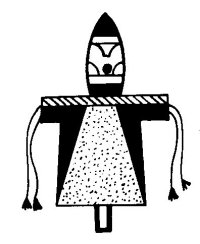
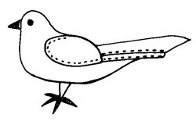

  
[Intangible Textual Heritage](../../../index)  [Native
American](../../index)  [Southwest](../index)  [Index](index) 
[Previous](yml04)  [Next](yml06) 

------------------------------------------------------------------------

p. 21

 

# The Narrators

### Ambrosio A. Castro

Age, 54. Born in La Palma, Sonora, and lived there or near Cocorit most
of his early life. His father was from Cocorit and his mother from
Bacum. During his youth he lived with his paternal grandmother, a curer
or "good witch." From her, he learned many ancient beliefs and tales.
His great-grandfather was said to have been a very famous *pascola*.
Castro has many relatives and friends in the Yaqui pueblos and enjoys
visiting about. At present he has no ceremonial affiliations. He fought
under Generals Matus and Espinosa with the conservative Yaqui faction,
but, later, when Yaquis were being hunted out and deported, he lived
like a Mexican, away from the Rio Yaqui. He worked as a house man, a
muleteer, railroad worker in Guaymas, and, much later, as a candy vendor
and a handyman at the government agricultural school near Vicam. Now,
when not farming with his family, he works as a traveling tinsmith,
visiting from pueblo to pueblo. He is an extrovert type, mixes easily
with all Yaquis, both conservative and liberal; however, some of the
more conservative Yaquis mistrust him. He enjoys telling tales and
composing poems

p. 22

in both Yaqui and Spanish, although he prefers to use Yaqui for this
purpose. He has a special interest in the old Yaqui culture and has a
remarkable memory for details. He refused to give detailed information
on the geography of the Rio Yaqui for fear that it might fall into the
hands of enemies of the Yaquis. He reads and writes both Spanish and
Yaqui, having learned to do so when he was past twenty years of age. His
information is reliable and of a wide variety.

 

### Lucas Chavez

Age, over 60. Born in the Rio Yaqui region at Torim. Suffered
considerably in his youth during the Mexican persecution of the Yaquis,
lost his family, escaped to work on a ranch in northern Sonora, then
worked his way up into Arizona on the railroad. Has since lived in
Pascua, near Tucson, Arizona. Has a good memory for details of ancient
lore which he heard in his youth. Can read and write Spanish, took part
in the establishment of the village of Pascua. In Sonora he began his
training as a *temasti* in the Yaqui church at Torim. In Pascua, he has
acted as third *maestro* or *temasti*. Lately he has been influenced by
Baptist missionaries in Pascua. His attitudes are bitterly anti-Mexican
and pro-American. He speaks both Yaqui and Spanish. His information
reflects a good knowledge of Yaqui-Catholic ritual and of Yaqui customs
and mythology.

p. 23

### Rafael Lopez

Age, about 45. Born in the United States and lives in the Yaqui colony,
Barrio Libre, near Tucson. He has no ceremonial affiliations or
ceremonial kin. He remembers little of his native culture and hardly
speaks any Yaqui. One of his sons is married to a Papago girl. His
attitudes toward Mexicans and Americans are equally favorable. His home
life resembles that of the Mexicans. He can read Spanish. As an
informant, his value lies in the fact that he exemplifies the marginal
type who has moved away from his culture, though he still thinks of
himself as a Yaqui.

 

### Maríano Tapia

Age, about 55. Born and lived in the region of the Rio Yaqui until the
age of 15 when he was captured and put to work on a Mexican fishing
barge out of Guaymas. Later, he came to Arizona where he has worked on
the railroad and as an adobe-layer and plasterer, living in the village
of Pascua. His wife and children are active members of the Baptist
church in Pascua. His attitudes toward the Mexicans are unfavorable. He
desires, but fears to return to his homeland. He regrets that his
children show little interest in the ancient Yaqui tradition.

p. 24

### Juan Valenzuela

Age, about 55. Native of the pueblo of Rahum. He heads the
*pueblo-mayor* group of Rahum, and is an ex-governor. He and his family
took active part in wars against the Mexicans. They lived in the sierras
when they were driven from their pueblo. He is now an active leader in
the most conservative faction of Yaquis and one of the chief powers in
the movement to re-establish Rahum in the place it had before the
revolution. He has worked on the railroad as far north as San Francisco
and knows Yaquis in the villages near Tucson, Arizona. Today he supports
his family by farming. His attitudes toward Americans are favorable, but
cautious. He trusts no Mexican and likewise is distrustful of many
Yaquis, who, in his mind, are traitors to the Yaqui cause by
compromising with the Mexicans. His knowledge of Yaqui-Catholic ritual
is broad. He was the only informant encountered who knew some of the
ancient Yaqui traditions by rote. He stipulated that the information he
gave should be printed only in English and only in the United States, in
order that Mexicans might not read it. He speaks and writes in both
Yaqui and Spanish.

 

Since the greatest number of stories in this collection were told by
Ambrosio A. Castro, those not designated as to source are his. Those
told by Lucas Chavez, Maríano Tapia, Rafael Lopez, and Juan Valenzuela
are marked with the initials LC, MT, RL, and JV.

------------------------------------------------------------------------

[Next: Yomumuli and the Little Surem People](yml06)
