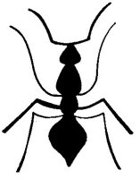
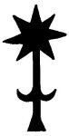

  
[Intangible Textual Heritage](../../../index)  [Native
American](../../index)  [Southwest](../index)  [Index](index) 
[Previous](yml11)  [Next](yml13) 

------------------------------------------------------------------------

p. 35

 

### Mochomo

ONCE there was a mochomo, a chieftain of the ants who was driving a mule
train of little mochomos. One night it turned very cold and snowed, and
the snow killed every one of his train of mules.

"I shall go to the king of the snow," said Mochomo, "He has killed all
of my mules!" He went to the house of the king of the snow, saying, "I
am angry. Your snow killed my mule train! If you are a brave man you
will fight me!"

"Oh, no," said the king of the snow, "I am not brave. I am very soft and
weak. There is a man who is stronger than I am and he is the sun. When
the sun shines on me I disappear."

"Well, I will go to see the sun then," shouted Mochomo. And he strode
off. To the sun he said, "The snow has killed all my train of mules. You
are braver than the snow, so I am going to fight you, since you are so
strong."

"Oh, no," said the sun, "there is one who is stronger than I. That is
the clouds. I have no strength when they cover me."

So Mochomo went to the king of the clouds, offering to fight him. The
king of the clouds said, "The strongest of all is the wind. It blows me
wherever it wills."

"Then I shall have to fight the wind. Where does he live?" asked
Mochomo.

"Down there in that blacksmith shop," said the king of the clouds.

p. 36

Mochomo went down to the blacksmith shop and strode up to the bellows.

"I am very angry. The snow killed all of my mules. Since you are the
strongest and bravest, I am going to fight you!" he shouted.

The bellows made no answer. Then suddenly they blew very hard, blowing
the angry Mochomo, chief of the ants, far away.

 

This is a fragment of a European fable variously named "L'Hormiguita,"
"El Aguila," or "El Zancudo." It has been recorded in other collections
of folklore on this continent from New Mexico, Jalisco, and Oaxaca (Boas
1912: 221-222).

------------------------------------------------------------------------

[Next: The Wax Monkey](yml13)
