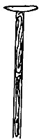

  
[Intangible Textual Heritage](../../../index)  [Native
American](../../index)  [Southwest](../index)  [Index](index) 
[Previous](yml14)  [Next](yml16) 

------------------------------------------------------------------------

p. 42

 

### The Stick That Sang

ON THE RIO YAQUI lived two brothers. They lived with their mother and
father. One day they went to some hill, I don't know just where, to pan
gold. There were two canyons at this place; one came from the north, and
the other from the east. The canyons met there. When it rained, the
water brought down gold. The boys went there to find gold. The smaller
boy rode a burro and the older one, a mule.

Miguel, the older boy, said, "José, you go up that canyon. I saw a lot
of gold up there."

Jose took his burro and went. Miguel stayed where he was. There was gold
there, but in little grains, only as big as wheat.

José hunted up in the canyon for a long time. At last he found a big
nugget, a ball of gold. When Miguel came up, he said, "Miguel, I have
found a big nugget."

"Let me see it."

"I don't want to show it to you."

"I want to see it," said Miguel.

The two boys fought, and Miguel hit José on the head with a rock and
killed him.

Miguel took the ball of gold. He buried José and piled up rocks on the
grave. He let José's burro go, and then left.

p. 41

When he arrived at his home his father said, "Where is José?"

"I lost him," said Miguel.

"Where?" asked the father.

"Over there."

"Well," said the father, "let's go hunt for him."

They set off and encountered the little burro on the road. "Who knows
what happened," said the father slowly. He began to cry. Miguel took him
to another hill. They found no one.

Many months passed and the muleteers who always went along the road
didn't know anything about it. After six months, a straight little stick
grew up out of the head of the dead boy. There was a little button on
top of the stick.

A muleteer stopped there one day at noon to let his animals graze. He
saw the little stick. "How strange," he said, and he grasped it with his
hand. Then the stick began to sing, saying, "For a ball of gold, my
brother killed me."

The muleteer cut the stick off and carried it with him very carefully.

After traveling three days, he arrived at a pueblo called San Marcial.
He took the little stick about the streets shouting, "I carry a stick
that sings. Two *reales* to hear it."

"What is this?" said the people. "He carries a stick that knows how to
sing? It couldn't be anything. It's not going to sing. Let's see. Let's
hear it sing."

The muleteer walked about, holding out his hat. The people threw in
money. His hat was almost filled.

Then the muleteer grasped the stick and it sang thus, "For a ball of
gold, a ball of gold, my brother killed me."

p. 44

The people were frightened. "What can this be? His brother killed him
for a ball of gold?" Many heard.

Now the muleteer went to another pueblo. He went through the streets
calling again, "I carry a little stick that sings all by itself!" Many
people gathered. They threw money into his hat. Then he made the stick
sing. It always sang, "For a ball of gold, my brother killed me."

Then the muleteer went on to the pueblo of Vicam. Here there were no
streets, only one house here, another there, just rancherías. Now the
father of Jose was living there and the muleteer said to him, "Wouldn't
you like to hear a little stick sing""

"Yes," said the old man.

"I will make it sing," said the muleteer. He grasped the stick and it
sang, "For a ball of gold, my brother killed me."

"That sounds like my own son!" said the old man. "It sounds like José,
the son I lost in the mountains."

Everything was discovered against Miguel. But Miguel said that he did
not kill his brother. The father did not know what to believe.

People came from the eight pueblos. And each pueblo had to say one word.
Each man who had a thought spoke. And one of them said, "Whoever killed
José would be carrying a ball of gold."

And it was found that Miguel was carrying a ball of gold. For that
reason he was discovered.

He was stood up in front of six soldiers. They shot him in the chest and
he died. They buried him. There it ends. MT

------------------------------------------------------------------------

[Next: The Two Bears](yml16)
