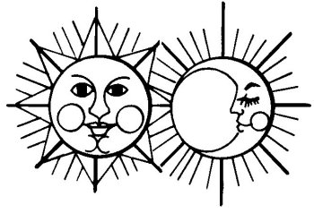

  
[Intangible Textual Heritage](../../../index)  [Native
American](../../index)  [Southwest](../index)  [Index](index) 
[Previous](yml17)  [Next](yml19) 

------------------------------------------------------------------------

p. 52

 

### Sun and Moon

THE SUN loves the moon. She is his sweetheart. He wants her for his
wife. But once the moon said to him, "I will marry you, but only on the
condition that you give me a gift. Anything suits me, but it must be to
my measurement."

"What kind of a gift would you like?" asked the sun.

"It doesn't matter, as long as it fits me."

"Good," said the sun. He brought her a gift, the best that there was.
But he could not get the correct measurement. He never could. He would
measure her carefully so that it would fit just right. Then he would
bring the gift and it would be too small, or maybe too large. So it went
on, and he never could fit her.

For this reason, the sun could never marry the moon. He loves her very
much and also he wants her because the wealth that she owns is durable.
The sun's wealth never lasts. It disappears very quickly. This tale is
very sad. LC

------------------------------------------------------------------------

[Next: Five Friends of Takochai](yml19)
