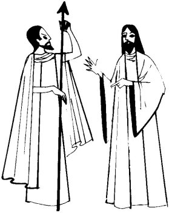

  
[Intangible Textual Heritage](../../../index)  [Native
American](../../index)  [Southwest](../index)  [Index](index) 
[Previous](yml36)  [Next](yml38) 

------------------------------------------------------------------------

p. 114

 

### San Pedro and the Devil

[JESUCRISTO](errata.htm#8) had many apostles and prophets the Devil was
constantly trying to tempt. Jesucristo would help them and give them
advice.

One day San Pedro was standing by a big cottonwood tree. The Devil came
up to him and said, "I hear that you are very powerful. I, also, am very
strong. If you can strike this tree with your fist so that your hand
goes through the trunk from one side to the other, I will admit that you
are stronger than me."

"Very well," said San Pedro, "but not right now, señor. Tomorrow."

Jesucristo came to the spot and San Pedro consulted with him. Jesucristo
bored a hole through the tree trunk and then covered up all evidence of
it.

The next day Jesucristo appeared at the contest and volunteered to act
as judge. He tapped the trunk and showed the contestants where to
strike.

First, he tapped a solid place and said to the Devil, "You try first."

The Devil struck the tree trunk and his hand

p. 115

entered only a few inches. Then San Pedro struck the trunk on the spot
indicated by Jesucristo. His arm went all the way through.

But the Devil was stubborn and always came back to try again. One day he
said to San Pedro, "I'll bring two spears and we will contest to see
which of us can throw one the farthest toward the other side of the
sea."

"Good, we will meet tomorrow," said San Pedro. Then he consulted with
Jesucristo.

On the hour, the Devil appeared before San Pedro with two spears. The
two stood on the seashore ready to throw. But when the Devil raised his
spear, it spoke, saying, "Spear, go to France and enter the body of the
mother of the Devil!"

"No, no!" said the Devil, lowering his arm and letting the spear fall to
the ground. So again the Devil lost.

Another day the Devil said to San Pedro, "Come here. The one who throws
a rock the farthest toward that island on the other side of the sea
wins."

San Pedro agreed. Jesucristo helped him. When they were both standing
ready, the Devil reached down and picked up a stone. San Pedro reached
into his pocket and pulled out something.

"Are you ready?" asked the Devil.

"Yes," replied San Pedro. Together, they threw. The Devil's rock fell
into the sea but San Pedro's disappeared far into the distance. It was a
little gray quail.

"Again you win over me!" he said. LC

Stories featuring San Pedro as a crafty character are widespread in
Mexico.

------------------------------------------------------------------------

[Next: Father Frog](yml38)
