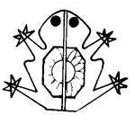

  
[Intangible Textual Heritage](../../../index)  [Native
American](../../index)  [Southwest](../index)  [Index](index) 
[Previous](yml37)  [Next](yml39) 

------------------------------------------------------------------------

p. 116

### Father Frog

WHEN A YAQUI man who is old and well off lies on his death bed, it is
the custom for his family to gather about him. Sometimes one of his sons
will ask the sick man, "If you should die in whose hands would you leave
your land?"

"Who is my best friend?" asks the man.

With the hope of being left the inheritance all answer, "*Nehpo*,
*Nehpo*, *Nehpo*," which means, "I, I, I."

Then the old man asks, "Who among you will accompany me then when I
die?"

No one answers.

It is thus among all of the animals too, even down to the little frogs.
The father frog, on his death bed, asks, "Who is my best friend?"

And all of the little frogs answer, "*Nehpo*, *Nehpo*, *Nehpo*."

You have heard them. LC

 

------------------------------------------------------------------------

[Next: Two Little Lambs](yml39)
