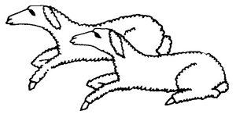

  
[Intangible Textual Heritage](../../../index)  [Native
American](../../index)  [Southwest](../index)  [Index](index) 
[Previous](yml38)  [Next](yml40) 

------------------------------------------------------------------------

p. 117

 

### Two Little Lambs

LONG AGO there were two little lambs who were not quite full grown. They
were walking about out in the country in the sierra on a large plain,
when a very hungry coyote walked out of the forest and came straight
toward one of them. "How are you, cousin?" said the coyote.

"Very well, my cousin," answered the lamb.

"I come to you very hungry, little one."

The lamb said, "What might I give you to eat? I am eating grass. But you
don't understand eating grass as I do."

"No, I do not like grass. But I would like to eat you, little cousin."

"Don't eat me," said the lamb, looking afar off. "Over there is one who
is much fatter. Let us go over to him."

"Yes, he is very fat. We will go over there."

The coyote and the lamb started off together toward the other lamb, and
the first lamb said to the coyote, "Wait for me a minute." And he

p. 118

took the other lamb apart while the coyote stood there and waited.

The first lamb said to the second, "Coyote wants to eat us. But we are
going to trick him. Let us each go away a distance and have a race. You
go toward where the sun is going down. I will go toward where the sun
rises, over there I will go. Then coyote will call us and we will run
toward him and when we come together, we will gore him quickly and tear
him apart with our horns. This way we will kill him."

"Good," said the other lamb.

Then they went up to the coyote and thus they spoke to him, "Here we
are, together. Together we will run a race, and he who wins, that lamb
you may eat."

One lamb marked a line on the ground with his hoof. "Stand here, little
cousin coyote. I am going over there toward where the sun goes down. My
brother is going toward where the sun comes up, and we will both stop.
When you call to us we will race here, toward you. He who wins, you will
eat."

"Very fine," said the coyote. He was happily jumping about and singing
and dancing and thinking of eating the little lamb.

The two lambs each went far off and stopped. Then the coyote, who was
watching them, called out. The two started running toward him. Equal
distance they neared him, and together, they arrived upon him, caught
him in the center and gored him. Together, they tore him and gored him.
Coyote was finished.

There you have it, my fathers.

------------------------------------------------------------------------

[Next: Maisoka and Hima'awikia](yml40)
