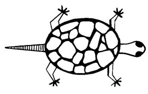
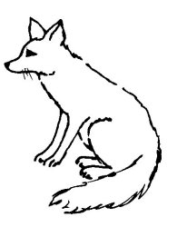

  
[Intangible Textual Heritage](../../../index)  [Native
American](../../index)  [Southwest](../index)  [Index](index) 
[Previous](yml42)  [Next](yml44) 

------------------------------------------------------------------------

p. 124

 

### Turtle and Coyote

ONE DAY IN the very hot month of August, the season of picking
pitahayas, a turtle was walking along under the branches of the pitahaya
plants. She was eating from the pitahayas which were ripe and which had
fallen to the ground. She was walking along with her mouth all red from
pitahaya juice.

As she walked along, she came upon a hungry coyote. The coyote greeted
her very courteously, and asked, "What is it that you have eaten which
makes your mouth all red?"

"I just ate a man. And if you bother me, I shall eat you too," the
turtle replied, opening her mouth and showing her teeth.

The coyote was frightened. After some time he said, "Friend turtle, tell
me where I can find something to eat."

"Come with me. At a big ranch I have some friends. They always feed me.
And everything they give me will be for you." Chatting thus, they walked
along. The coyote and the turtle had been walking for some time when the
coyote, desperate

p. 125

with hunger, said, "When are we going to arrive at this ranch? Is it
very much farther?"

"No, no, it isn't far," answered the turtle. But this was a lie, for
there was no ranch at all.

They went on walking for a long time. Again the coyote asked, "Is it far
away?"

"No, not far," answered Madame Turtle, walking at his own pace, very
slowly. And the coyote, about to fall down from hunger, said to the
turtle, "Why don't you walk just a bit faster?"

"Oh," said the turtle, "I can't walk very fast. When I travel fast,
smoke begins to rise from my feet. Look at my feet and you'll see there
is no smoke under them at all."

The coyote put his nose down and walked behind the turtle, looking at
her feet--and dying of hunger. Finally the coyote fell down in a faint,
without strength. He did not eat the turtle, nor did he eat at the
ranch, nor did he ever see smoke rise from the turtle's feet. He died.
And the turtle went on walking.

This took place in the very beginning of the world, when the coyote was
more silly than he is now, the most ignorant of all the animals.

 

------------------------------------------------------------------------

[Next: Coyote and Rabbit](yml44)
