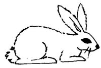
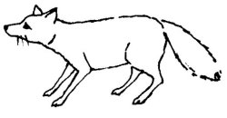

  
[Intangible Textual Heritage](../../../index)  [Native
American](../../index)  [Southwest](../index)  [Index](index) 
[Previous](yml43)  [Next](yml45) 

------------------------------------------------------------------------

p. 126

 

### Coyote and Rabbit

ONE DAY rabbit was out on a plain eating when Coyote came up. "I am very
hungry," said Coyote. "I am going to eat you."

"No, wait here and I will bring you a really good meal of chicken. They
are cooking it over there." Rabbit ran off toward the monte and Coyote
happily waited, singing in anticipation of a fine meal. He waited a long
time. At last he became angry and followed the tracks of Rabbit.

He found Rabbit in an arroyo standing by the cliff wall holding his
forepaws against the cliff. "What are you doing?" asked Coyote.

"I am holding this cliff up," said Rabbit. At that moment a little rock
fell and he held the cliff up harder than ever. "Here," he said to
Coyote, "you hold it up while I go and get the food I told you about. It
is almost ready."

Coyote put his paws against the cliff, pushing desperately while Rabbit
ran off. Another rock fell and Coyote pushed all the harder. He waited
for a long time. He was very tired and terribly hungry. Suddenly he let
go of the cliff and ran as fast as he could. Nothing happened. He
followed the tracks of Rabbit.

'Now I really am going to eat you!"

p. 127

"Just sit down," said Rabbit. "They are going to bring that food right
here. They'll be here soon." So Coyote sat down, looking hungrily at
Rabbit. Rabbit jumped up saying, "I'll hurry them. You wait here just a
minute." He ran off. Coyote waited.

Meanwhile, Rabbit set fire all around the edges of the thicket. Then he
ran back to Coyote. "Hear the *cohetes*?" he shouted to Coyote. "The
fiesta is coming. They are bringing you a wonderful meal." Then Rabbit
ran away as fast as he could to avoid the fire. Coyote happily danced
and sang as he waited for his meal. The fire soon surrounded him and he
was burned up.

 

The above incident and others form a cycle of tales which has a wide
distribution among the Latin Americans of Mexico and Southwestern United
States (Espinosa 1914b: 211-212). Also, incidents featuring various
animals are found among widely separated American Indian groups as, for
instance, the Tepecanos of Mexico (Mason and Espinosa 1914: 204), the
Cochiti of New Mexico (Benedict 1935: 308), and the Papagos of Arizona
(Jane Chesky, Field Notes 1942).

------------------------------------------------------------------------

[Next: Heron and Fox](yml45)
