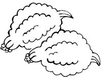

  
[Intangible Textual Heritage](../../../index)  [Native
American](../../index)  [Southwest](../index)  [Index](index) 
[Previous](yml51)  [Next](yml53) 

------------------------------------------------------------------------

p. 137

 

### The Calabazas Funeral

ONE TIME I sowed lots of corn and beans and squashes, many, many
squashes. When I harvested, I filled my whole house full of squashes.
When I had put them all away, I fell sick. But I wasn't sick for very
long, because I died. By afternoon, just about time for the sun to go
down, I fell down dead.

I was alone in my house. Soon all the important people gathered to
attend my funeral. Well, these great people are supposed to be served
lots of food at a fiesta or a funeral and there was nothing in my house
but squashes, squashes, nothing more.

Prey made great fires and began to cook squashes all night long. And the
drum kept talking and accusing the people of eating squashes. It said,

*kamak kamak kamak kamak kamak  
kamak ka kam kamak ka kam kamak*.

This means, "sweet squashes, squashes, squashes." All night long the
drum kept saying this. And it is absolutely true. Those people finished
every single squash. At dawn there wasn't one squash in the house.

When they were about to bury me, I noticed that there were no more
squashes, so I revived.

------------------------------------------------------------------------

[Next: Suawaka](yml53)
