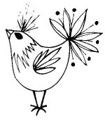

  
[Intangible Textual Heritage](../../../index)  [Native
American](../../index)  [Southwest](../index)  [Index](index) 
[Previous](yml54)  [Next](yml56) 

------------------------------------------------------------------------

p. 143

 

### Why the Animals Remain Animals

BAI'IKURI was tall and very strong. He worked hard to support his
children. Sometimes he would go to the sea to get fish and oysters.
Other times he would go into the sierra and gather honey, roots of
various kinds, and also fruit. Part of these things he would give to his
children and the rest he would trade for hides in order to clothe them.

One day he came back loaded with a great deal of fruit. He was tired,
and wet from sweating. He sat down on a piece of a log in the shade of a
mesquite tree, rolled a cigarette, lit it, and smoked for a while.

Immediately many birds gathered around him. Among them was a bird called
Wa'ikumarewi.

Sitting there in the shade, Bai'ikuri sneezed, "ha'achis!"

Wa'ikumarewi wanted to imitate him. He also sneezed, "ha'achis!" But he
jerked his head so hard that his neck broke and his head flew off and
fell far away.

After that none of the animals ever wanted to imitate men.

------------------------------------------------------------------------

[Next: Coyote Woman](yml56)
