[Intangible Textual Heritage](../../index)  [Native American](../index) 
[Index](index)  [Previous](wa02)  [Next](wa04) 

------------------------------------------------------------------------

 

1\. After the rushing waters (had subsided) the Lenape of the turtle
were close together, in hollow houses, living together there.

1\. Pehella wtenk lennapeva tulapewini psakwiken woliwikgun wittank
talli.

 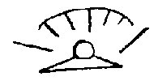

2\. It freezes where they abode, it snows where they abode, it storms
where they abode, it is cold where they abode.

2\. Topan-akpinep, wineu-akpinep, kshakan-akpinep, thupin akpinep.

 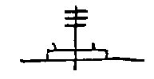

3\. At this northern place they speak favorably of mild, cool (lands),
with many deer and buffaloes.

3\. Lowankwaminkwulaton wtakan tihill kelik meshautang sili ewak.

 

4\. As they journeyed, some being strong, some rich, they separated into
house-builders and hunters;

4\. Chintanes-sin powalessin peyachik wikhichik pokwihil.

 

5\. The strongest, the most united, the purest, were the hunters.

5\. Eluwi-chitanesit eluwi takauwesit, elowi chiksit, elowichik
delsinewo.

 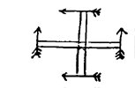

6\. The hunters showed themselves at the north, at the east, at the
south, at the west.

6\. Lowaniwi, wapaniwi, shawaniwi, wunkeniwi, elowichik apakachik.

 

7\. In that ancient country, in that northern country, in that turtle
country, the best of the Lenape were the Turtle men.

7\. Lumowaki, lowanaki tulpenaki elowaki tulapiwi linapiwi.

 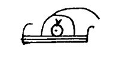

8\. All the cabin fires of that land were disquieted, and all said to
their priest, "Let us go."

8\. Wemiako yagawan tendki lakkawelendam nakopowa wemi owenluen atam.

 

9\. To the Snake land to the east they went forth, going away, earnestly
grieving.

9\. Akhokink wapaneu wemoltin palliaal kitelendam aptelendam.

 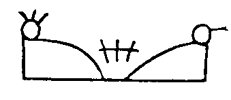

10\. Split asunder, weak, trembling, their land burned, they went, torn
and broken, to the Snake Island.

10\. Pechimuin shakowen \[Var. showoken\] nungihillan lusasaki pikihil
pokwihil akomenaki.

 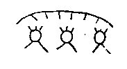

11\. Those from the north being free, without care, went forth from the
land of snow, in different directions.

11\. Nihillapewin komelendam lowaniwi wemiten chihillen maniaken.

 

12\. The fathers of the Bald Eagle and the White Wolf remain along the
sea, rich in fish and muscles.

12\. Namesuagipek pokhapockhapek guneunga waplanewa ouken waptumewi
ouken.

 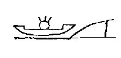

13\. Floating up the streams in their canoes, our fathers were rich,
they were in the light, when they were at those islands.

13\. Amokolon nallahemen agunouken pawasinep wapasinep akomenep.\[Var.
menakinep.\]

 

14\. Head Beaver and Big Bird said, "Let us go to Snake Island," they
said.

14\. Wihlamok kicholen luchundi, Wematam akomen luchundi.

 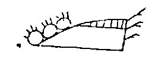

15\. All say they will go along to destroy all the land.

15\. Witehen wemiluen wemaken nihillen.

 

16\. Those of the north agreed, Those of the east agreed. Over the
water, the frozen sea, They went to enjoy it.

16\. Nguttichin lowaniwi, Nguttichin wapaniwi, Agamunk topanpek Wulliton
epannek.

 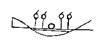

17\. On the wonderful slippery water, On the stone-hard water all went,
On the great Tidal Sea, the muscle-bearing sea. They walk and walk, all
of them.

17\. Wulelemil w'shakuppek, Wemopannek hakhsinipek, Kitahikan
pokhakhopek.

 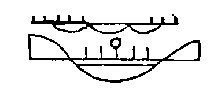

18\. Ten thousand at night, All in one night, To the Snake Island, to
the east, at night, They walk and walk, all of them.

18\. Tellenchen kittapakki nillawi, Wemoltin gutikuni nillawi, Akomen
wapanawaki nillawi, Ponskan, ponskan, wemiwi olini.

 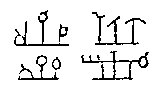

19\. The men from the north, the east, the south, The Eagle clan, the
Beaver clan, the Wolf clan, The best men, the rich men, the head men,
Those with wives, those with daughters, those with dogs,

19, Lowanapi, wapanapi, shawanapi, Lanewapi, tamakwapi, tumewapi,
Elowapi, powatapi, wilawapi, Okwisapi, danisapi, allumapil,

 

20\. They all come, they tarry at the land of the spruce pines; Those
from the west come with hesitation, Esteeming highly their old home at
the Turtle land.

20\. Wemipayat gune'unga shinaking, Wunkenapi chanelendam payaking,
Allowelendam kowiyey tulpaking.

------------------------------------------------------------------------

[Next: Part IVa](wa04)
