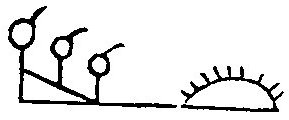

[Intangible Textual Heritage](../../index)  [Native American](../index) 
[Index](index)  [Previous](wa07)  [Next](wa09) 

------------------------------------------------------------------------

 

20\. East-Villager was chief; he was east of Talega.

20\. Wapalawikwan sakimanep waptalegawing.

 

21\. A great land and a wide land was the east land,

21\. Amangaki amigaki wapakisinep.

 

22\. A land without snakes, a rich land, a pleasant land.

22\. Mattakohaki mapawaki mawulitenol.

 

23\. Great Fighter was chief, toward the north.

23\. Gikenopalat sakimanep pekochilowan.

 

24\. At the Straight river, River-Loving was chief.

24\. Saskwihanang hanaholend sakimanep.

 

25\. Becoming-Fat was chief at Sassafras land.

25\. Gattawisi sakimanep winakaking.

 

26\. All the hunters made wampum again at the great sea.

26\. Wemi lowichik gishikshawipek lappi kichipek.

 

27\. Red-Arrow was chief at the stream again.

27\. Makhiawip sakimanep lapihaneng.

 

28\. The Painted-Man was chief at the Mighty Water.

28\. Wolomenap sakimanep maskekitong.

 

29\. The Easterners and the Wolves go northeast.

29\. Wapanand tumewand waplowaan.

 

30\. Good-Fighter was chief, and went to the north.

30\. Wulitpallat sakimanep piskwilowan.

 

31\. The Mengwe, the Lynxes, all trembled.

31\. Mahongwi pungelika wemi nungwi.

 

32\. Again an Affable was chief, and made peace with all,

32\. Lappi tamenend sakimanepit wemi langundit.

 

33\. All were friends, all were United, under this great chief

33\. Wemi nitis wemi takwicken sakima kichwon.

 

36\. Great-Beaver was chief, remaining in Sassafras land.

36\. Kichitamak sakimanep winakununda.

 

37\. White-Body was chief on the sea shore.

37\. Wapahakey sakimanep sheyabian.

 

38\. Peace-Maker was chief, friendly to all.

38\. Elangomel sakimanep makeliwulit.

 

39\. He-Makes-Mistakes was chief, hurriedly coming.

39\. Pitenumen sakimanep unchihillen.

------------------------------------------------------------------------

[Next: Part Vc](wa09)
