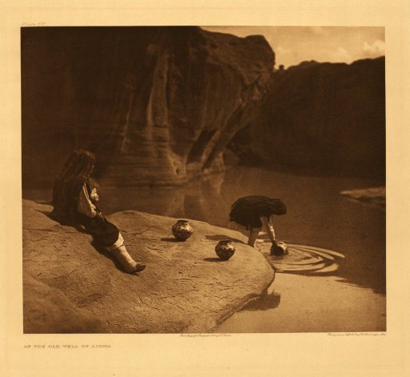

[Sacred-Texts](../../../index)  [Native American](../../index) 
[Southwest](../../sw/index)  [Zuñi](../index) 

------------------------------------------------------------------------

<table width="75%">
<colgroup>
<col style="width: 50%" />
<col style="width: 50%" />
</colgroup>
<tbody>
<tr class="odd">
<td width="50%"></td>
<td width="50%"><h1 id="ruth-bunzel-on-zuñi-religion">Ruth Bunzel on Zuñi Religion</h1></td>
</tr>
</tbody>
</table>

------------------------------------------------------------------------

The following are from The Forty-Seventh Annual Report of the Bureau of
American Ethnology, 1929-1930, the Smithsonian Institution, Washington
D.C.  

Ruth Bunzel (b. 1898) was a prominent anthropologist who studied the
Zuñi in the early 20th century. The following are detailed ethnographic
accounts of Zuñi religious beliefs and practices.

------------------------------------------------------------------------

 [Table of Zuñi
Sounds](sounds)  
 [Introduction to
Zuñi Ceremonialism by Ruth Bunzel](zunirel) *215,769 bytes*  
 [Zuñi Origin Myths
by Ruth Bunzel](zom) *66,114 bytes*  
 [Zuñi Ritual
Poetry by Ruth Bunzel](zrp) *310,414 bytes*  
