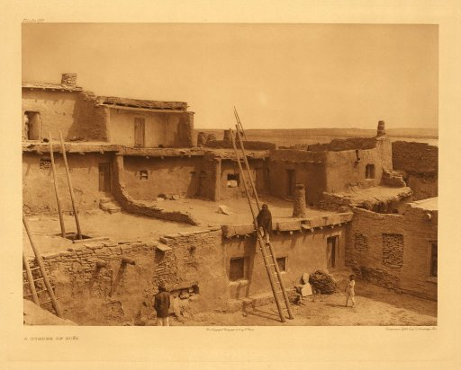

[Sacred-Texts](../../../index)  [Native American](../../index) 
[Southwest](../../sw/index)  [Zuñi](../index) 

------------------------------------------------------------------------

<table width="75%">
<colgroup>
<col style="width: 50%" />
<col style="width: 50%" />
</colgroup>
<tbody>
<tr class="odd">
<td width="50%"></td>
<td width="50%"><h1 id="frank-hamilton-cushing-on-zuñi-religion">Frank Hamilton Cushing on Zuñi Religion</h1></td>
</tr>
</tbody>
</table>

------------------------------------------------------------------------

Frank Cushing (1857-1900), was one of the first anthropologists to study
the Zuñi. Eventually he was initiated into the highest levels of the
Zuñi religion.

------------------------------------------------------------------------

 [Zuñi Folk
Tales](../zft/index) \[1901\] This is a superb collection of Zuñi folk
tales.

This is a selection of excerpts from his writings.

 [Outline of Zuñi
Mytho-Sociologic Organization](cush00)
 [Zuñi
Fetiches](cush01) 
[Remarks on Shamanism](cush02)
 [Form *and* Form
and the Dance Drama](cush03)
 [Corn Raising: The
Decay of the Seed](cush04)
 [Corn Raising: The
Regeneration of the Seed](cush05)
 [Clowns, Priests,
and Festivals of the Kâ'-kâ](cush06)
 [Creation and the
Origin of Corn](cush07)
