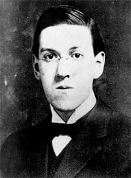

 

<table width="75%">
<colgroup>
<col style="width: 50%" />
<col style="width: 50%" />
</colgroup>
<tbody>
<tr class="odd">
<td width="50%" data-valign="TOP"></td>
<td width="50%" data-valign="CENTER"><h3 id="an-h.-p.-lovecraft-anthology">An H. P. Lovecraft Anthology</h3></td>
</tr>
</tbody>
</table>

------------------------------------------------------------------------

H.P. Lovecraft is now appreciated as one of the best horror stylists of
the 20th century, although for years he worked in pulp obscurity, only
known to a small circle of fans and fellow writers. However, he died
without heirs and the bulk of his copyrights were never renewed. Hence a
great amount of Lovecraft's output passed into the public domain. The
following tales are currently in the public domain in the United States
by the terms of the Digital Millennium Copyright Act because they were
either 1) published prior to January 1st, 1923 or 2) never renewed at
the US Copyright office.

------------------------------------------------------------------------

[The Alchemist (1916)](hpl00)  
[The Beast in the Cave (1918)](hpl01)  
[Beyond the Wall of Sleep (1919)](hpl02)  
[Dagon (1919)](hpl03)  
[Memory (1919)](hpl04)  
[The Picture in the House (1919)](hpl05)  
[The White Ship (1919)](hpl06)  
[The Cats of Ulthar (1920)](hpl07)  
[The Doom That Came to Sarnath (1920)](hpl08)  
[Nyarlathotep (1920)](hpl09)  
[Polaris (1920)](hpl10)  
[The Statement of Randolph Carter (1920)](hpl11)  
[The Street (1920)](hpl12)  
[Ex Oblivione (1921)](hpl13)  
[Facts Concerning the Late Arthur Jermyn and His Family (1921)](hpl14)  
[The Nameless City (1921)](hpl15)  
[The Terrible Old Man (1921)](hpl16)  
[The Tree (1921)](hpl17)  
[Celephais (1922)](hpl18)  
[The Music of Erich Zann (1922)](hpl19)  
[The Tomb (1922)](hpl20)  
[Hypnos (1923)](hpl21)  
[The Lurking Fear (1923)](hpl22)  
[What the Moon Brings (1923)](hpl23)  
[In the Vault (1925)](hpl24)  
[He (Weird Tales, 1926)](hpl25)  
[The Moon-Bog (Weird Tales, 1926)](hpl26)  
[The Colour Out of Space (1927)](hpl27)  
[The Horror at Red Hook (Weird Tales, 1927)](hpl28)  
[Pickman's Model (Weird Tales, 1927)](hpl29)  
[Cool Air (1928)](hpl30)  
[The Call of Cthulhu (Weird Tales, 1928)](hpl31)  
[The Dunwich Horror (Weird Tales 1929)](hpl32)  
[The Silver Key (Weird Tales, 1929)](hpl33)  
[The Strange High House in the Mist (Weird Tales, 1931)](hpl34)  

### The Whisperer in the Darkness (Weird Tales, 1931)

[Chapter 1](hpl35)  
[Chapter 2](hpl36)  
[Chapter 3](hpl37)  
[Chapter 4](hpl38)  
[Chapter 5](hpl39)  
[Chapter 6](hpl40)  
[Chapter 7](hpl41)  
[Chapter 8](hpl42)  

 

[The Other Gods (1933)](hpl43)  
[The Dreams in the Witch House (Weird Tales, 1933)](hpl44)  
[From Beyond (1934)](hpl45)  
[The Quest of Iranon (1935)](hpl46)  
[The Haunter of the Dark (Weird Tales, 1936)](hpl47)  

### The Shadow out of Time (Astonishing Stories, 1936)

[Chapter 1](hpl48)  
[Chapter 2](hpl49)  
[Chapter 3](hpl50)  
[Chapter 4](hpl51)  
[Chapter 5](hpl52)  
[Chapter 6](hpl53)  
[Chapter 7](hpl54)  
[Chapter 8](hpl55)  

 

[The Shunned House (Weird Tales, 1937)](hpl56)  
[The Thing on the Doorstep (Weird Tales, 1937)](hpl57)  
[Azathoth (1938)](hpl58)  
[The Book (1938)](hpl59)  
[The Descendant (1938)](hpl60)  
[The Evil Clergyman (Weird Tales, 1939)](hpl61)  

### The Case of Charles Dexter Ward (Weird Tales, 1941)

[I. A Result and a Prologue](hpl62)  
[II. An Antecedent and a Horror](hpl63)  
[III. A Search and an Evocation](hpl64)  
[IV. A Mutation and a Madness](hpl65)  
[V. A Nightmare and a Cataclysm](hpl66)  

 

### The Shadow over Innsmouth (Weird Tales, 1942)

[Chapter I](hpl67)  
[Chapter II](hpl68)  
[Chapter III](hpl69)  
[Chapter IV](hpl70)  
[Chapter V](hpl71)  

 

### The Dream-Quest of Unknown Kadath (The Arkham Sampler, 1948)

[Part I](hpl72)  
[Part II](hpl73)  
[Part III](hpl74)  
[Part IV](hpl75)  
[Part V](hpl76)  

 
