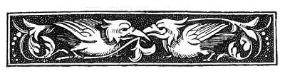

  
[Intangible Textual Heritage](../../../index)  [Sagas and
Legends](../../index)  [Basque](../index)  [Index](index) 
[Previous](bl18)  [Next](bl20) 

------------------------------------------------------------------------

[Buy this Book at
Amazon.com](https://www.amazon.com/exec/obidos/ASIN/1402193092/internetsacredte)

------------------------------------------------------------------------

p. 47

 

# IV.--BASA-JAUN, BASA-ANDRE, AND LAMIÑAK.

IT is somewhat difficult to get a clear view of what Basa-Jaun and
Basa-Andre, the wild man and the wild woman, really are in Basque
mythology. In the first tale here given Basa-Jaun appears as a kind of
vampire, and his wife, the Basa-Andre, as a sorceress, but we know of no
other such representation of the former. Basa-Jaun is usually described
by Basque writers as a kind of satyr, or faun, a wood-sprite; and
Basques, in speaking of him to us, have frequently used the French term,
"Homme de Bouc," "He-goat-man," to describe him. In some tales he
appears rather as a species of brownie, and has received the familiar
sobriquet of Ancho, [1](#fn_37) from the Spanish
Sancho. In this character he haunts the shepherds' huts in the
mountains, warms himself at their fires, tastes their clotted milk and
cheese, converses with them, and is treated with a familiarity which,
however, is never quite free from a hidden terror. His wife, the
Basa-Andre, appears sometimes as a sorceress, sometimes as a kind of
land-mermaid, as a beautiful lady sitting in a cave and "combing her
locks with a comb of gold," in remote mountain parts. [2](#fn_38)

The Lamiñak are true fairies, and do not differ more from the general
run of Keltic fairies than the Scotch, Irish,

p. 48

\[paragraph continues\] Welsh, and Cornish
fairies do from each other. In fact, the legends are often identical.
The Lamiñak were described to us by one who evidently believed in, and
dreaded them, as little people who lived underground. Another informant
stated that they were little people who came down the chimney. They long
to get possession of human beings, and change and carry off infants
unbaptized, but they do not seem to injure them otherwise. They bring
good luck to the houses which they frequent; they are fond of
cleanliness, but always speak and give their orders in words exactly the
opposite of their meaning. In common with Basa-Jaun and Basa-Andre they
hate church bells, [1](#fn_39) and though not
actively hostile to Christianity, are driven away as it advances. They
were formerly great builders of bridges, and even of churches, [2](#fn_40) but were usually defrauded of their wage,
which was to have been power over some human soul at the completion of
the contract. Fairies' wells and fountains are common in the Landes and
neighbouring Gascon provinces, but we know of none in the Pays
Basque. [3](#fn_41) We failed distinctly to make
out what are the "fairies' holes (Lamiña-ziloak)," spoken of in the
Heren-Suge tale ([p. 36](bl14.htm#page_36)); as far as we could gather
from the narrator they are simply bare places in hedges, when covered by
the web of the gossamer spider. We know of no dances by moonlight on
fairy rings of green herbage; but if the reader will carefully eliminate
from his memory the rare fancies of Shakespeare and Ben Jonson about
Puck, Oberon, and Titania, he will find little otherwise to
differentiate between the Basque Lamiñak and the fairies of Sir Walter
Scott, of Campbell, and of Croker's "Irish Legends." One peculiarity
certainly is that all the Basque Lamiñak are sometimes said to be all
called "Guïllen," [4](#fn_42) which

p. 49

appears to be the same as the French Guillaume, and our William.

It must be a sign of a failing belief and interest that witches and
fairies are so often confounded. In these few stories it is evident that
the witch is often a fairy, and the fairy a witch.

------------------------------------------------------------------------

### Footnotes

[47:1](bl19.htm#fr_37) *Cf.* Cerquand, Part I.,
p. 27, Ancho et les Vaches," and notes. Also Part II., 341 et seq.

[47:2](bl19.htm#fr_38) *Cf.* Cerquand, Part I.,
pp. 33, 34, "La Dame au Peigne d'Or."

[48:1](bl19.htm#fr_39) Cerquand, Part I., p. 30,
"Basa-Jauna et le Salve Regina."

[48:2](bl19.htm#fr_40) Cerquand, "L'Eglise
d'Espés." "Le Pont de Licq," Part I., pp. 31, 32, and Part II., pp.
50-52.

[48:3](bl19.htm#fr_41) But compare the well or
marsh of the Basa-Andre in the Tartaro tale, [p. 15](bl09.htm#page_15).

[48:4](bl19.htm#fr_42) Cerquand, Part I., pp.
32, 33.

------------------------------------------------------------------------

[Next: Basa-Jauna, The Wild Man](bl20)
