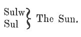

  
[Intangible Textual Heritage](../../../index) 
[Legends/Sagas](../../index)  [Celtic](../index)  [Barddas](../bim) 
[Index](index)  [Previous](bim1035)  [Next](bim1037) 

------------------------------------------------------------------------

[Buy this Book at
Amazon.com](https://www.amazon.com/exec/obidos/ASIN/1578633079/internetsacredte)

------------------------------------------------------------------------

  
*The Barddas of Iolo Morganwg, Vol. I.*, ed. by J. Williams Ab Ithel,
\[1862\], at Intangible Textual Heritage

------------------------------------------------------------------------

### THE THREE FIRST WORDS OF THE CYMRAEG.

 
*Bardism*.

p. 70 p. 71

The three first words of the Cymraeg: the Name of God, that is O I U;
the name of the Sun, perception, and sensation, that, is SULW; and Bo,
others say, BYW.

The Name of God is a substantive verb; the sun is a substantive noun;
and sulw is a substantive adjective--which was clear before the perfect
Cymraeg was lost.

------------------------------------------------------------------------

[Next: The Primary Letters.--Names of the Coelbrens](bim1037)
