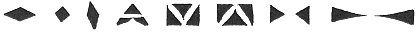

  
[Intangible Textual Heritage](../../../index) 
[Legends/Sagas](../../index)  [Celtic](../index)  [Barddas](../bim) 
[Index](index)  [Previous](bim1042)  [Next](bim1044) 

------------------------------------------------------------------------

[Buy this Book at
Amazon.com](https://www.amazon.com/exec/obidos/ASIN/1578633079/internetsacredte)

------------------------------------------------------------------------

  
*The Barddas of Iolo Morganwg, Vol. I.*, ed. by J. Williams Ab Ithel,
\[1862\], at Intangible Textual Heritage

------------------------------------------------------------------------

### THE SIXTEEN PRIMARY SYMBOLS.

 

------------------------------------------------------------------------

[Next: Introduction of Letters.--Original Country of the Cymry.--Their
Arrival in Britain.--Augmentation of the Alphabet](bim1044)
