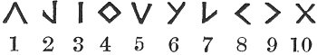
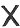
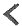
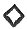
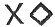

  
[Intangible Textual Heritage](../../../index) 
[Legends/Sagas](../../index)  [Celtic](../index)  [Barddas](../bim) 
[Index](index)  [Previous](bim1049)  [Next](bim1051) 

------------------------------------------------------------------------

[Buy this Book at
Amazon.com](https://www.amazon.com/exec/obidos/ASIN/1578633079/internetsacredte)

------------------------------------------------------------------------

  
*The Barddas of Iolo Morganwg, Vol. I.*, ed. by J. Williams Ab Ithel,
\[1862\], at Intangible Textual Heritage

------------------------------------------------------------------------

### THE THREE SYMBOLS OF SCIENCES.

There have been three symbols of sciences in use by the nation of the
Cymry from the beginning.

The symbol of word and speech, that is to say, a letter, ten fold,
sixteen fold, twenty fold, and twenty-four fold.

The first of the three, in respect of privilege and origin, is the
symbol of word and speech, that is to say, a letter.

The second, the symbol of harmony, that is to say, tone and music.

The third, the symbol of number, which is thus,--

 

That is to say, one, two, three, four, five, six, seven, eight, nine,
ten, one-ten and one, one-ten and two, one-ten and three, one-ten and
four, one-ten and five, one-ten and six, one-ten and seven, one-ten and
eight, one-ten and nine, two-tens; and as before to three-tens,
four-tens, five-tens, six-tens, seven-tens, eight-tens, nine-tens, a
hundred; and to a thousand; and from thence to ceugant. It is a secret
kept from the beginning by the voice of the Gorsedd of the Bards of the
Isle of Britain; and it was first appointed as a special art in the
sciences of wisdom by Tydain, father of Awen, who also arranged the
symbols of the art of musical

p. 98 p. 99

harmony, in respect of voice, string, and bellows, as is exhibited in
the memorials of the Bards of the Isle of Britain. (From the Second Book
of the Secret of the Bards of the Isle of Britain, and from the
Yniales. [1](#fn_129))

Let the following be added to the above system of symbols;  , 2  , 3  , 4  , 5  , 6  , 7  , 8  , 9  , 
, or  ;
but some put   for a
hundred, and   for a
thousand.

------------------------------------------------------------------------

### Footnotes

[99:1](bim1050.htm#fr_130) p. 98 "The Yniales. That book, the work of Hopkin ap
Thomas of Glyn Tawy, contained various matters, memorials, and sciences
appertaining to things advantageous to be known. He lived in Ynys Tawy,
and made the Gwernllwyn Chwith. Llywelyn the Red, son of Meurig the
Aged, sang his praise."--MS.

In a poem addressed to Hopkin ap Thomas by Davydd y Coed, who flourished
1300--1350, mention is made of the Yniales as being in the former's
possession.

"----- mae yn ei lys  
Eur ddar y Lucidarius  
A’r Great ar *Yniales*."

"------ There are in his court,  
The golden oak, Elucidarius,  
And the Great and *Yniales*."--Myv. Arch. vol. i. p. 494.

------------------------------------------------------------------------

[Next: The Three Primitive Symbols.--The Three Coelbren
Symbols](bim1051)
