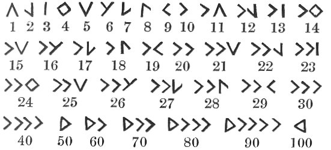
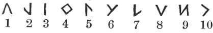
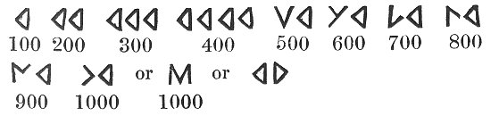
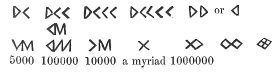
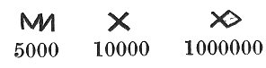

  
[Intangible Textual Heritage](../../../index) 
[Legends/Sagas](../../index)  [Celtic](../index)  [Barddas](../bim) 
[Index](index)  [Previous](bim1056)  [Next](bim1058) 

------------------------------------------------------------------------

[Buy this Book at
Amazon.com](https://www.amazon.com/exec/obidos/ASIN/1578633079/internetsacredte)

------------------------------------------------------------------------

  
*The Barddas of Iolo Morganwg, Vol. I.*, ed. by J. Williams Ab Ithel,
\[1862\], at Intangible Textual Heritage

------------------------------------------------------------------------

### NUMERALS.

Numeration. Numbers.

 

Another mode according to the numeral letters.

 

Another mode according to the numeral letters.

 

Also thus;--

 

p. 112 p. 113

Another,--

 

------------------------------------------------------------------------

[Next: The Numerals](bim1058)
