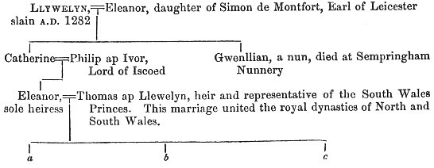
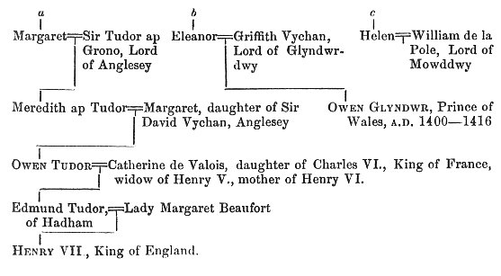

  
[Intangible Textual Heritage](../../../index) 
[Legends/Sagas](../../index)  [Celtic](../index)  [Barddas](../bim) 
[Index](index)  [Previous](bim1063)  [Next](bim1065) 

------------------------------------------------------------------------

[Buy this Book at
Amazon.com](https://www.amazon.com/exec/obidos/ASIN/1578633079/internetsacredte)

------------------------------------------------------------------------

  
*The Barddas of Iolo Morganwg, Vol. I.*, ed. by J. Williams Ab Ithel,
\[1862\], at Intangible Textual Heritage

------------------------------------------------------------------------

### COELBREN OF THE BARDS.

Thus says Llywelyn Sion.

After the intestine war of Owain Glyndwr, [1](#fn_158) the king [2](#fn_159) forbade paper and plagawd to be brought
into Cymru, or to be manufactured there, in order that it might prevent
epistolary correspondence between a Cymro and a Cymro, and between the
Cymry and the people of a bordering country and of foreign lands; and
this to revenge the siding with Owain, which was observed every where on
the part of every man in Cymru. He also forbade the Bards and Poets to
go their circuits,

p. 134 p. 135

and to visit the different families officially. Then was remembered, and
brought into use, the ancient custom of the Bards of the Isle of
Britain; namely, the cutting of letters, which they called the symbols
of language and utterance, upon wood or rods prepared for the purpose,
called Coelbren of the Bards--and thus was it done. They gathered rods
of hazel or mountain ash in the winter, about a cubit in length, and
split each into four parts, that is, the wood was made into four
splinters, and kept them, until by the working of time they became quite
dry. Then they planed them square, in respect of breadth and thickness,
and afterwards trimmed down the angles to the tenth part of an inch,
which was done that the cuttings of the letters, that is, the symbols,
which were cut with the knife on one of the four square surfaces, should
not visibly encroach upon the next face; and thus on every one of the
four faces. Then they cut the symbols, according to their character,
whether they were those of language and speech, or of numbers, or other
signs of art, such as the symbols of music, of voice, and string. And
after cutting ten of such bars as were required, they prepared four
splinters, two and two, which were called pill, planed them smooth,
placed two of them together side by side across the frame, and marked
the places for ten holes. After that, they cut the holes, that is, half
of each of the ten holes, in one splinter, and the same in the other;
and they did the same with the other two splinters; and these are called
pillwydd. Then they took the symbolized or lettered bars, and made a
neck at each of the two ends of every bar, all round, the breadth of a
finger, along the bar. Then they placed the lettered sticks by their
necks on one of the pillwydd at one end, and in like manner at the other
end; and on that the other pillwydd at each end, hole for hole. And at
both ends of two pillwydden they made necks, as places for strings to
tie them firmly together at each end of the symbolized sticks. And when
the whole are thus bound tight together, the book that is constructed in
this manner is called *Peithynen*, because it is framed; the

p. 136 p. 137

pillwydd at each end keeping all together, and the ebillion, or lettered
staves, turning freely in the pillwydd, and thus being easy to read.
That is, one face of the chill is read first, according to the number of
its face, then it is turned with the sun, and the second face is read,
and it is turned so for every other face, and thus from ebill to ebill
until the reading is finished. A number from one to ten being on the
turning face of each of the ebillion, the numbered face is the first
that is to be read, and then the others in the order of their course
with the sun.

There are forty sides to the ebillion in every Peithynen; after that,
another Peithynen is formed, until the conclusion of the poem or
narrative. And where more than ten ebillion are required, and less than
twenty, as many ebillion as are required are placed altogether in one
entire Peithynen. The reason of assigning ten as the particular number
of succession, is, that ten is the division point of number, and under
the number of decades are all numbers arranged, until language cannot
give them names. Ten is a perfect circle, and ten within ten, or ten
about ten, will be within and without the circumference, circle within
circle, for ever and ever; therefore the best arrangement of number and
numbers is ten and tens. And it is not possible by any other method to
keep accounts in an orderly manner, in strong places, so that they may
be read and understood, and recited, uniformly and consistently.

After having, for the reasons shewn, restored to memory and use the old
primitive art of the Cymry in letters and symbols, it was submitted to
the judgment and observation of the Chairs and Gorsedds of vocal song of
Deheubarth and Morganwg, and the Eisteddvods of Gwynedd and Powys, that
they might search out what had been lost of the sciences of the symbols
of the Bardic Coelbren, and what improvement and extension had been made
in the kind and number of the symbols. Then they confirmed sixteen
characters as general ones from the beginning, and the additions, which
had been made to that number from time to time until the era

p. 138 p. 139

of the Blue Bard, [1](#fn_160) when they were
confirmed as twenty-one primary symbols, in respect of the vocalization
of the Cymraeg. After that, they fixed the number of the common ones at
twenty-four; nor were any more appointed for domestic learning and
sciences; but the Bards had on their secret Coelbren thirty-eight, of
ancient preservation and secret record, which they restored to use and
practice. And it was not understood that more than ten of them, which
were called the ten primitives, ought to be put under an oath of
secrecy; these were put under the forms of sworn secrecy, whilst the
whole thirty eight were left a secret, but without vow or oath; and from
that they became common, as they are now.

After recovering the knowledge of the Coelbrens, that is, the one of the
Bards and the one of the Monks, nearly every person, male and female,
wished to learn and construct them. From thence they became the trade of
sieve-makers and basket-makers, and upon them was cut the record of
every thing that required the preserved memorial of letter and book. And
thus it was until the time of Henry the Seventh, who, being a
Cymro, [2](#fn_161) took his countrymen under
the protection of his courtesy, and placed

p. 140 p. 141

them, at his own expense, under the instruction of the monks, and
furnished them gratuitously with as much paper and parchment as was
required; and they were taught whichever they would of the two
languages, Welsh or English, and many learned both. On that account the
knowledge of letters was more frequent among the common people in Wales
than it was in England; and from hence also there were more than enough
of Poets, whom the abbots placed here and there as scholars, from which
it happens that the Poets are domestic schoolmasters unto the present
day, proceeding on their appointed circuits from house to house, and
from family to family. The old Coelbrens are frequently to be seen and
beheld, but now a Peithynen is not often made, except for a degree in
Chair, or for the payment of money, or the value of money, from the
person who might order it, according to the need of him ordering it.
There are many now living who remember the use of the Coelbren of the
Bards, and many a Coelbren may still be seen in the houses of the old
noble families.

The account, according to old memorials and letters, and the memorials
of the voice of Gorsedd, which have been preserved by Chairs from the
beginning, is as follows, namely;--

Ten symbolic characters of utterance, in respect of language and speech,
have been in possession of the nation of the Cymry from the age of ages
before they came into the island of Britain, which were a secret under
vow and oath among, the Gwyddoniaid, these persons being Poets and men
of vocal song and sciences of wisdom before there were regular Bards. It
was in the time of Prydain, son of Aedd the Great, about one thousand
five hundred years before Christ was born in the flesh of the pure and
blessed Mary, and in the time of Aedd the Great, that regular Bards were
instituted, and authorized office and license assigned to them. After
that, the Coelbren of the Gwyddoniaid was improved, as occasion required
for its being understood and read, until there were sixteen symbols in
the Alphabet.

p. 142 p. 143

\[paragraph continues\] And it was in the
time of Dyvnwal Moelmud, about six hundred years, by record and
computation, before Christ was born in the flesh, that the sixteen
symbols, and their order for the preservation of language and speech and
every memorial of country and nation, were divulged, because no other
method could be found so good for maintaining the memorials and sciences
of wisdom, and the privileges and usages of the nation of the Cymry, and
its appurtenances. And the ten symbolic characters are kept to this day
as a secret by vow and oath; and no man, except those who have taken the
oath, knows them. When the sixteen became generally open to all the
nation, the Coelbren was further improved and extended, till it
consisted of eighteen in the time of Beli the Great, son of Manogan; and
after that of twenty; and, in the time of the Blue Bard, of twenty-one,
or, as another record says, of twenty-two; and so many are there of
primitive letters in the Cymraeg, such as are beyond this number, as far
as thirty-eight, being called secondaries.

------------------------------------------------------------------------

### Footnotes

[133:1](bim1064.htm#fr_159) p. 132 Owain Glyndwr was born A.D. 1349. He began
to wage war against the English king, about A.D. 1400, which was
continued for about fifteen years, when Owain died, i.e. A.D. 1415.

[133:2](bim1064.htm#fr_160) The Cymric
chieftain fought against two king, successively, namely, against p. 133 Henry IV. and against Henry V., the latter
of whom succeeded to the throne AD. 1413, two years before the death of
Owain.

[139:1](bim1064.htm#fr_161) p. 138 About A.D. 900. Geraint was the author of a
Cymric Grammar, which was preserved among the MSS. in Rhaglan Castle,
before it was destroyed in the wars of the Commonwealth.

[139:2](bim1064.htm#fr_162) Being the grandson
of Owain Tudur, of Penmynydd, in Anglesey, who had married Catherine of
France, the queen dowager of Henry V., A.D. 1428. It was in Henry VII.
that the British dynasty was restored, according to the vaticinations of
the Bards; and it is somewhat remarkable that he was also the rightful
heir of Llywelyn, the last independent prince of Wales, and that
consequently Queen Victoria reigns over the Principality by inheritance,
and not in right of conquest. This may be seen from the following table;

 

p. 139

 

------------------------------------------------------------------------

[Next: Coelbren of the Bards](bim1065)
