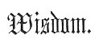

  
[Intangible Textual Heritage](../../../index) 
[Legends/Sagas](../../index)  [Celtic](../index)  [Barddas](../bim) 
[Index](index)  [Previous](bim1125)  [Next](bim1127) 

------------------------------------------------------------------------

[Buy this Book at
Amazon.com](https://www.amazon.com/exec/obidos/ASIN/1578633079/internetsacredte)

------------------------------------------------------------------------

  
*The Barddas of Iolo Morganwg, Vol. I.*, ed. by J. Williams Ab Ithel,
\[1862\], at Intangible Textual Heritage

------------------------------------------------------------------------

p. 368 p. 369

 

### TRIADS OF WISDOM. [1](#fn_336)

1\. There are three Gorsedd cries: the cry of greeting; the cry of
claim; and the cry of efficiency.

2\. There are three authoritative cries: the cry of country and nation
to begin; cry relative to a pledge, in right of claim; and cry for a
recurrency, in virtue of obligation.

3\. There are three unities: one God, that is, the one primary element,
from Whom proceeds every living and existing thing; one truth, from
which proceed every knowledge and mental intelligence; and one point of
liberty, from which proceed every strength and operation.

4\. Three things incapable of change: the laws of nature; the quality of
truth; and the laws of Bardism; for whatever is found to be beautiful,
good, and just, belongs to each one of those things.

5\. According to the three principal dispositions of man will be his
migration in Abred: from slothfulness and mental blindness he will fall
to Annwn; from his dissolute wantonness he will traverse the circle of
Abred, according to the necessity laid upon him; and from his love of
goodness he will ascend to the circle of Gwynvyd. According as

p. 370 p. 371

one or other of the three principal dispositions prevails, will be the
state of man; hence his three states, Annwn, Abred, and Gwynvyd.

6\. The three states of living beings: Annwn, where there is a
beginning; Abred, where knowledge is accumulated, and hence goodness;
and Gwynvyd, where is the fulness of every goodness, of knowledge,
truth, love, and endless life.

7\. The three necessities of man in Abred: natural goodness, and hence
intelligence, reason, and sciences; vigour, and hence love, hatred,
fear, hope, awen, sorrow, and joy--and from the union of vigour and
goodness proceed mercy, generosity, love, and courage; inherent
blindness, and hence all hatred, ignorance, anger, pride, and
covetousness; and where the two first do not predominate over the third,
man will fall in Abred when he dies, and parts with life in this world.

8\. The three necessities of man in Gwynvyd: godliness; love; and light;
and from the three proceed all power, all knowledge, and all everlasting
joy, and hence all goodness without cessation, without end.

9\. There are three primary elements: corporeity; fluidity and air.

------------------------------------------------------------------------

### Footnotes

[369:1](bim1126.htm#fr_338) p. 368 These Triads have been selected from a
series entitled "Triads of Wisdom," which, together with the "Triads of
Bardism," and the "Triads of St. Paul," were required to be recited at
every meeting for public worship.

"There are three Triads of worship: the Triads of Bardism; the Triads of
p. 369 Paul; and the Triads of Wisdom; and
they ought to be recited in every resort of worship."

------------------------------------------------------------------------

[Next: The Elements](bim1127)
