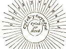

  
[Intangible Textual Heritage](../../../index) 
[Legends/Sagas](../../index)  [Celtic](../index)  [Barddas](../bim) 
[Index](index)  [Previous](bim1158)  [Next](bim1160) 

------------------------------------------------------------------------

[Buy this Book at
Amazon.com](https://www.amazon.com/exec/obidos/ASIN/1578633079/internetsacredte)

------------------------------------------------------------------------

  
*The Barddas of Iolo Morganwg, Vol. I.*, ed. by J. Williams Ab Ithel,
\[1862\], at Intangible Textual Heritage

------------------------------------------------------------------------

p. 418 p. 419

### THE ALBANS.

They are as follows in the Book of Sion Howel Gwyn--the Book of
Tre’rbryn:--

Alban Elved is the calend of October;  
Alban Arthan is the calend of January;  
Alban Eilir is the calend of spring;  
Alban Hevin is the calend of summer.

------------------------------------------------------------------------

[Next: The Divisions of the Year](bim1160)
