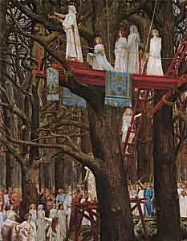

  
[Intangible Textual Heritage](../../../index) 
[Legends/Sagas](../../index)  [Celtic](../index)  [Barddas](../bim) 

------------------------------------------------------------------------

[Buy this Book at
Amazon.com](https://www.amazon.com/exec/obidos/ASIN/1578633079/internetsacredte)

------------------------------------------------------------------------

<table width="75%">
<colgroup>
<col style="width: 50%" />
<col style="width: 50%" />
</colgroup>
<tbody>
<tr class="odd">
<td width="50%" data-valign="TOP"> 
Druids Cutting the Mistletoe on the Sixth Day of the Moon, by Henri Paul Motte [ca. 1890-1900] (Public Domain Image)</td>
<td width="50%" data-valign="CENTER"><h1 id="the-barddas-of-iolo-morganwg" data-align="CENTER">The Barddas of Iolo Morganwg</h1>
<h2 id="j.-williams-ab-ithel-editor" data-align="CENTER">J. Williams Ab Ithel (editor)</h2>
<h3 id="vol.-i" data-align="CENTER">Vol. I</h3>
<h4 id="section" data-align="CENTER">[1862]</h4></td>
</tr>
</tbody>
</table>

------------------------------------------------------------------------

[Contents](#contents)    [Start Reading](bim1000)    [Page
Index](pageidx)   

------------------------------------------------------------------------

|                                                                                                                           |
|---------------------------------------------------------------------------------------------------------------------------|
|  |

The Barddas of Iolo Morganwg is a collection of writings, largely
forged, about ancient Welsh Bardic and Druidic beliefs. Although the
author of this work is cited as J. Williams Ab Ithel, he was actually
the editor, who pieced it together from manuscripts written by Iolo
Morganwg. Iolo Morganwg (1747-1826), itinerant poet and scholar, was a
key figure in the Druid revival of the 19th century. He was personally
responsible for reviving the Welsh national poetry contest, the Gorsedd.
On June 21st, 1792, Midsummer evening, Iolo and a dozen other Welsh
poets gathered on Primrose Hill in London and held the first Gorsedd in
hundreds of years. Iolo was a Welsh patriot and held revolutionary
views; he was a personal friend of [Tom
Paine](../../../aor/paine/index), and George Washington subscribed to
his first volume of poetry. He is said to have influenced both William
Blake's poetry and Robert Grave's [White
Goddess](https://www.amazon.com/exec/obidos/ASIN/0374504938/internetsacredte).
He revived the concept that the Welsh explorer Madoc discovered America.
This led to an expedition to Mandan territory in the Great Plains, which
found no trace of the Welsh, but was one of the inspirations for Thomas
Jefferson's Lewis and Clarke expedition.

Iolo Morganwg's contributions to world culture are still with us today;
there is an extensive neo-Druid movement; and the Gorsedd (and Welsh
nationalism) are still going strong. The Gorsedd is held annually during
the Eisteddfod in Wales, a festival of Welsh culture. Two other Celtic
regions, Cornwall and Brittany, have also adopted the Gorsedd.

Iolo Morganwg, born Edward Williams, a native speaker of both English
and Welsh, spent his entire life collecting and transcribing mediaeval
Welsh documents, as well as writing poetry under his own byline. He was
also a first-rate literary forger of ancient Welsh; some have commented
that his forgeries were as good or better than the real thing.
Furthermore, he wrote much of the Barddas under the influence of
laudanum (an opium-based medication which he took for asthma). Scholars
have spent two centuries trying to establish which parts of his
extensive writings purporting to be based on ancient manuscripts are
genuine, and which he wrote personally. Our understanding is still very
murky. For these reasons, Iolo's writings are considered highly
controversial.

Because Druidic beliefs were exclusively transmitted orally, we have no
primary accounts of it, so there is practically nothing to compare this
text with. What we do know is summarized neatly in the Preface to this
work, and consists of a few excerpts from classical authors. The longest
account is from Julius Caesar, who was more interested in exterminating
Druids, so he was hardly a disinterested observer.

However, this is one of those *visionary* texts which is worth reading
for its own merits, irrespective of whether it is 'genuine' or not.
Taken at face value, the Barddas remains a fascinating text. It has
resonances with the [Upanishads](../../../hin/upan/index),
[Kabbalah](../../../jud/index.htm#kabbalah), and
[Freemasonry](../../../mas/index). The Bardic alphabet presented in the
'Symbol' section is completely invented, based on Runic and Ogham, and
has utility as a magical alphabet. However it is about as genuine as the
alphabets of [J.R.R. Tolkien](../../../ring/index). The 'Theology'
section appears to be based on Iolo's peculiar Christian views (he
described himself as a Unitarian Quaker). 'Theology' also contains a
great number of Triads, some of which may be from authentic ancient
Bardic lore. The 'Wisdom' section has a great deal of mythopoetic
information, some of which is authentic, some not. The Barddas is great
reading if you are at all interested in the ancient Druids, as long as
you keep in mind the background of its creation.

Production notes: I have omitted the Welsh text of this book, which was
printed on the even numbered pages, but retained all page numbers. The
English footnotes often started on the facing (preceding) page and
occasionally continue on for several pages, so I have taken care to
document page numbers in footnotes. I have omitted sporadic footnotes
which were only relevant to the Welsh text, except in a few cases where
they also impact the understanding of the English translation. These
footnotes use asterisks instead of numbers.

John B. Hare, November 6, 2005.

------------------------------------------------------------------------

 [Title Page](bim1000)  
[Welsh Manuscript Society](bim1001)  
[Advertisement](bim1002)  

### Preface

[Preface](bim1003)  
[Julius Cæsar](bim1004)  
[Strabo](bim1005)  
[Diodorus Siculus](bim1006)  
[Cicero](bim1007)  
[Pliny](bim1008)  
[Pomponius Mela](bim1009)  
[Diogenes Laertius](bim1010)  
[Suetonius](bim1011)  
[Ammianus Marcellinus](bim1012)  
[Tacitus](bim1013)  
[Druids and Bards](bim1014)  

 

[Llywelyn Sion](bim1015)  
[Contents](bim1016)  
[A List of Documents](bim1017)  

### Symbol

[The Origin of Letters, Roll, and Paper.--The Virtue of
Letters](bim1018)  
[The Origin and Progress of Letters.--The Name of God.--The Bardic
Secret](bim1019)  
[The First Inventors of Letters.--Improvers of the Alphabet.--Invention
of the Roll and Plagawd.--Obligation of a Bard to Hold a Chair and
Gorsedd](bim1020)  
[Origin of Letters](bim1021)  
[The Inventor of Vocal Song.--The First Recorders of Bardism.--Its First
Systematizers.--Their Regulations.--Mode of Inscribing the Primary
Letters.--Origin of Their Form and Sound.--The Three Menws](bim1022)  
[The Principal Elements of Various Things.--The Gogyrvens](bim1023)  
[The Invention of Letters by Einigan and Menw.--The Secret of
Bardism](bim1024)  
[Cuttings.--Foundations of Awen](bim1025)  
[Origin and Progress of Letters.--Einigan the Giant.--The
Gwyddoniaid.--Systems of Letters](bim1026)  
[The Origin of Letters and Books.--Their Introduction into Britain--The
Coelbren](bim1027)  
[The Primary Letters.--Improvement of the Alphabet](bim1028)  
[Primary Cuttings.--Improvement of the Coelbren.--Its
Restoration](bim1029)  
[Recovery of the Old Cymraeg](bim1030)  
[The Primary Letters.--Their Augmentation.--Restoration of the
Coelbren](bim1031)  
[The Bardic Secret](bim1032)  
[The Sacred Symbol](bim1033)  
[The Primary Letters.--Improvement of the Alphabet](bim1034)  
[Gogyrvens.--Writing With Ink](bim1035)  
[The Three First Words of the Cymraeg](bim1036)  
[The Primary Letters.--Names of the Coelbrens](bim1037)  
[Classification of the Letters](bim1038)  
[The Bardic Secret.--Formation of Letters](bim1039)  
[The Vowels](bim1040)  
[The Primary Letters](bim1041)  
[Variations of Letters](bim1042)  
[The Sixteen Primary Symbols](bim1043)  
[Introduction of Letters.--Original Country of the Cymry.--Their Arrival
in Britain.--Augmentation of the Alphabet](bim1044)  
[Coelbren of the Bards, According to the Arrangement of
Llawdden](bim1045)  
[The Symbols of Literary Sciences.--Improvement of the
Coelbren.--Metrical Canons.--Dissolution of the Monastery of Pen
Rhys](bim1046)  
[The Pillars of Memory.--The Symbols](bim1047)  
[The Birds of Rhianon](bim1048)  
[The Five Ages of Letters](bim1049)  
[The Three Symbols of Sciences](bim1050)  
[The Three Primitive Symbols.--The Three Coelbren Symbols](bim1051)  
[Numbers](bim1052)  
[The Nine Degrees of Numerals](bim1053)  
[The System of Numerals](bim1054)  
[Arithmetic](bim1055)  
[The System of Numerals](bim1056)  
[Numerals](bim1057)  
[The Numerals](bim1058)  
[The Arithmetical Characters of the Ancient Cymry; That is, the
Numerals](bim1059)  
[The Three Symbols](bim1060)  
[The Materials of Language and Speech](bim1061)  
[The Three Wreathed Bards](bim1062)  
[Coelbren of the Bards](bim1063)  
[Coelbren of the Bards](bim1064)  
[Coelbren of the Bards](bim1065)  
[Peithynen](bim1066)  
[Coelbren of the Bards](bim1067)  
[Secret Coelbren.--Secret Coelvain.--Coelvain of History](bim1068)  
[Burning the Letters](bim1069)  
[Coelbren of Simple Letters](bim1070)  
[Palm Coelbren](bim1071)  
[Peithyn Coelbren.--Palm Coelbren](bim1072)  
[Peithynvain](bim1073)  
[Memorials](bim1074)  
[Plagawd](bim1075)  
[The Three Principal Materials of Knowledge](bim1076)  
[The Herald-Bard](bim1077)  
[Dasgubell Rodd](bim1078)  

### Theology

[Triads of Bardism](bim1079)  
[Theological Triads](bim1080)  
[Theological Triads](bim1081)  
[Theological Triads](bim1082)  
[Theological Triads](bim1083)  
[Theological Triads](bim1084)  
[Theological Triads](bim1085)  
[Druidism](bim1086)  
[God](bim1087)  
[Cythraul](bim1088)  
[Ceugant.--Duration.--God](bim1089)  
[The Three Imperceptibilities of God](bim1090)  
[The Bards' Enigma](bim1091)  
[The Twelve Primary Negatives](bim1092)  
[Bardic Aphorisms](bim1093)  
[The Divine Names](bim1094)  
[IAU](bim1095)  
[Hu the Mighty](bim1096)  
[The Circles](bim1097)  
[The Book of Bardism](bim1098)  
[Abred.--Gwynvyd.--Awen](bim1099)  
[The Three States](bim1100)  
[Annwn.--Life.--Death](bim1101)  
[Abred](bim1102)  
[The Origin of Man.--Jesus Christ.--Creation](bim1103)  
[The Creation.--The First Man.--The Primary Letters](bim1104)  
[The Discipline Of Bardism. The Creation](bim1105)  
[The Creation.--Worship.--Vocal Song.--Gwyddoniaid](bim1106)  
[The Material of the World](bim1107)  
[The Fall In Abred](bim1108)  
[God in the Sun](bim1109)  
[God in the Light](bim1110)  
[Triads of Bardism](bim1111)  
[God; and the Faculties of the Soul](bim1112)  
[Sentences of Bardism](bim1113)  
[The Ten Commandments of the Bards](bim1114)  
[The Ten Commandments of the Bards](bim1115)  
[The Rudiments of Theology](bim1116)  
[The Triads of St. Paul](bim1117)  
[The Triads of St. Paul](bim1118)  
[The Triads of St. Paul and Bardism](bim1119)  
[Triads of Bardism and Usages](bim1120)  
[Triads of Bardism](bim1121)  
[The Mode of Taking Food and Drink](bim1122)  
[The Gorsedd Prayer](bim1123)  
[The Prediction of Peredur, The Bard of Prydain](bim1124)  
[The Stanza of the Gorsedd Chair of the Winter Solstice](bim1125)  

### Wisdom

[Triads of Wisdom](bim1126)  
[The Elements](bim1127)  
[Triads of Bardism. The Elements](bim1128)  
[The Triads of Bardism, Called the Triads of Ionabwy. The
Elements](bim1129)  
[Bardism, &c. The Elements](bim1130)  
[The Elements](bim1131)  
[The Elements](bim1132)  
[The Elements](bim1133)  
[Bardism. The Elements](bim1134)  
[The Materials](bim1135)  
[The Elements](bim1136)  
[The Elements](bim1137)  
[The Materials of Man](bim1138)  
[The Eight Materials of Man](bim1139)  
[The Seven Materials of Man](bim1140)  
[The Seven Primary Materials of the World](bim1141)  
[The Eight Materials of Man](bim1142)  
[The Parts of the Human Body in Which are the Faculties](bim1143)  
[The Philosophy of the Blue Bard of the Chair](bim1144)  
[Particular Triads](bim1145)  
[Triads of Ten Numbers](bim1146)  
[Mutual Reasoning Between a Disciple and his Teacher](bim1147)  
[The Stars](bim1148)  
[Astronomy](bim1149)  
[Chronology](bim1150)  
[Chronology](bim1151)  
[The Memorial of Computation.--The Memorial of Country](bim1152)  
[Memorial and Computation](bim1153)  
[The Cycle of Time](bim1154)  
[The Months](bim1155)  
[The Beginning of the Year](bim1156)  
[The Three Circles of the Sun](bim1157)  
[The Four Quarters of the Year](bim1158)  
[The Albans](bim1159)  
[The Divisions of the Year](bim1160)  
[The Divisions of the Year](bim1161)  
[The Divisions of the Year](bim1162)  
[The Divisions Of The Year](bim1163)  
[The Divisions of the Year](bim1164)  
[The Divisions of the Day](bim1165)  
[The Divisions of the Day](bim1166)  
[The Divisions of the Day](bim1167)  
[The Divisions of the Day](bim1168)  
[The Divisions of the Day](bim1169)  
[Years of the Sun and Moon](bim1170)  
[Years of the Sun and Moon](bim1171)  
[Years of the Sun And Moon](bim1172)  
[Days of Days](bim1173)  
