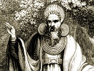

  
[Intangible Textual Heritage](../../../index) 
[Legends/Sagas](../../index)  [Celtic](../index)  [Barddas](../bim) 
[Index](index)  [Previous](bim2002)  [Next](bim2004) 

------------------------------------------------------------------------

[Buy this Book at
Amazon.com](https://www.amazon.com/exec/obidos/ASIN/1578633079/internetsacredte)

------------------------------------------------------------------------

  
*The Barddas of Iolo Morganwg, Vol. II.*, ed. by J. Williams Ab Ithel,
\[1874\], at Intangible Textual Heritage

------------------------------------------------------------------------

### THE TRIADS OF THE BARDS.--THE TRIADS OF PRIVILEGE AND USAGE.

(From the Book of Llywelyn Sion.)

The following are the Triads of the Bards of the Isle of Britain, and
the memorials and records thereof, as preserved by the voice of Gorsedd
of the Bards of the Isle of Britain--together with their essence and
nature.

When the Cymry first came into the island of Britain from the Country of
Summer, where they had been previously

p. 40 p. 41

from the age of ages, the primitive knowledge, and original wisdom, were
preserved in memory and record, and taught by the Gwyddoniaid.

------------------------------------------------------------------------

[Next: The Triads of Privilege and Usage](bim2004)
