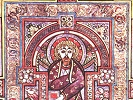

  
[Intangible Textual Heritage](../../../index)  [Legends and
Sagas](../../index)  [Celtic](../index)  [Index](index) 
[Previous](bok12)  [Next](bok14) 

------------------------------------------------------------------------

  
*The Book of Kells*, by Edward Sullivan, \[1920\], at Intangible Textual
Heritage

------------------------------------------------------------------------

PLATE IX.

THE MONOGRAM PAGE. FOL. 34 R.

  [  
Click to enlarge](img/pl09.jpg)  
Plate IX  

XPI B GENERATIO

(Christi autem generation)

St. Matthew i. 18.

See Introduction, pages 15 and 18.

------------------------------------------------------------------------

[Next: Plate X. A Page of the Text. Fol. 104 R](bok14)

