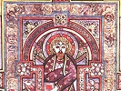

  
[Intangible Textual Heritage](../../../index)  [Legends and
Sagas](../../index)  [Celtic](../index)  [Index](index) 
[Previous](bok26)  [Next](bok28) 

------------------------------------------------------------------------

  
*The Book of Kells*, by Edward Sullivan, \[1920\], at Intangible Textual
Heritage

------------------------------------------------------------------------

PLATE XXIII.

COMPOUND LETTERS.

  [  
Click to enlarge](img/pl23.jpg)  
Plate XXIII  

(From copies by Helen Campbell D'Olier.)

DIXerunt QUi dixit

SEd neque GEneratio

------------------------------------------------------------------------

[Next: Plate XXIV. Compound Letters](bok28)

