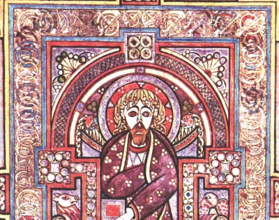

  
[Intangible Textual Heritage](../../../index)  [Legends and
Sagas](../../index)  [Celtic](../index) 

------------------------------------------------------------------------

<table width="75%">
<colgroup>
<col style="width: 50%" />
<col style="width: 50%" />
</colgroup>
<tbody>
<tr class="odd">
<td width="50%" data-valign="TOP"></td>
<td width="50%" data-valign="CENTER"><h1 id="the-book-of-kells" data-align="CENTER">The Book of Kells</h1>
<h2 id="by-edward-sullivan" data-align="CENTER">by Edward Sullivan</h2>
<h4 id="section" data-align="CENTER">[1920]</h4></td>
</tr>
</tbody>
</table>

------------------------------------------------------------------------

[Contents](#contents)    [Start Reading](bok00)    [Page
Index](pageidx)    [Text \[Zipped\]](bok.txt.gz)

------------------------------------------------------------------------

During the dark ages the arts of bookmaking, illustration and manuscript
illumination were preserved in remote Irish abbeys. A number of unique,
exquisite books remain from this period, masterpieces of world art. This
includes the ninth century Book of Kells, a manuscript of the Gospel
richly illustrated with Celtic motifs and deep symbolism. This book
includes an extended introduction to the Book of Kells, along with its
historic and linguistic background. We have included high resolution
scans of the illustrations, which include many famous pages from this
amazing manuscript.

------------------------------------------------------------------------

 [Title Page](bok00)  
[Prefatory Note](bok01)  
[Preface to Second Edition](bok02)  
[List of Plates](bok03)  
[Introduction](bok04)  

### Illustrations

[Plate I. A Page of the Eusebian Canons. Fol. 5 R](bok05)  
[Plate II. The Virgin and Child. Fol. 7 V.](bok06)  
[Plate III. Portion of the ''Argument'' to the Gospel of St. John. fol.
19 V](bok07)  
[Plate IV. The Evangelical Symbols. Fol. 27 V.](bok08)  
[Plate V. Portrait of St. Matthew](bok09)  
[Plate VI. The Opening Words of St. Matthew's Gospel. Fol. 29
R.](bok10)  
[Plate VII. Portrait of St. Mark or St. Luke. Fol. 32 V](bok11)  
[Plate VIII. The Eight-Circled Cross. Fol. 33 R](bok12)  
[Plate IX. The Monogram Page. Fol. 34 R.](bok13)  
[Plate X. A Page of the Text. Fol. 104 R](bok14)  
[Plate XI. Tunc Crucifixerent XPI Cum Os latrones. Fol. 124 R](bok15)  
[Plate XII. The Evangelical Symbols. Fol. 129 V](bok16)  
[Plate XIII. The Opening Words of St. Mark's Gospel. Fol. 130
R](bok17)  
[Plate XIV. The Opening Word of St. Luke's Gospel. Fol. 188 R](bok18)  
[Plate XV. The Genealogy of Christ. Fol. 200 R.](bok19)  
[Plate XVI. The Genealogy—continued. Fol. 200 V](bok20)  
[Plate XVII. The Genealogy—continued. Fol. 201 R](bok21)  
[Plate XVIII. Portrait of St. John. Fol. 291 V.](bok22)  
[Plate XIX. The Opening Words of St. John's Gospel. Fol. 292 R](bok23)  
[Plate XX. Compound Letters](bok24)  
[Plate XXI. Compound Letters](bok25)  
[Plate XXII. Compound Letters](bok26)  
[Plate XXIII. Compound Letters](bok27)  
[Plate XXIV. Compound Letters](bok28)  
