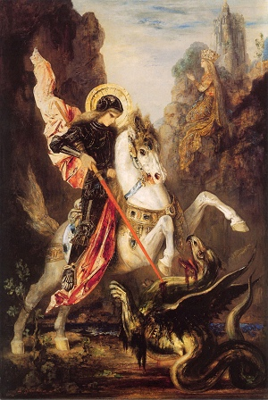

  
[Intangible Textual Heritage](../../../index)  [Legends and
Sagas](../../index)  [Celtic](../index)  [Legendary
Creatures](../../../lcr/index) 

------------------------------------------------------------------------

[Buy this Book at
Amazon.com](https://www.amazon.com/exec/obidos/ASIN/0766192504/internetsacredte)

------------------------------------------------------------------------

<table width="75%">
<colgroup>
<col style="width: 50%" />
<col style="width: 50%" />
</colgroup>
<tbody>
<tr class="odd">
<td width="50%" data-valign="TOP"> 
St. George, by Gustave Moreau [19th cent.] (Public Domain Image)</td>
<td width="50%" data-valign="CENTER"><h1 id="the-celtic-dragon-myth" data-align="CENTER">The Celtic Dragon Myth</h1>
<h2 id="by-j.f.-campbell" data-align="CENTER">by J.F. Campbell</h2>
<h4 id="section" data-align="CENTER">[1911]</h4></td>
</tr>
</tbody>
</table>

------------------------------------------------------------------------

[Contents](#contents)    [Start Reading](cdm00)    [Page
Index](pageidx)    [Text \[Zipped\]](cdmtxt.zip)

------------------------------------------------------------------------

|                                                                                                                           |
|---------------------------------------------------------------------------------------------------------------------------|
|  |

The Scottish folklorist J.F. Campbell pieced together the tale of the
Celtic Dragon, an intricate oft-told story involving not just dragons
but mermaids, giants, and *sidhe* (fairies). This story, or portions
thereof, is found in many Indo-European folklore traditions, as far
afield as India. Campbell includes not only his merged narrative, but
original Gaelic texts for two of the episodes. Campbell is best known
for his four volume [Popular Tales of the Western Highlands](../ptwh),
also available at this site. The book includes a contribution by George
Henderson, the Gaelic text and an English translation of the related
tale of Fraoch and the Dragon.

------------------------------------------------------------------------

 [Title Page](cdm00)  
[Table of Contents](cdm01)  
[Introduction](cdm02)  
[The Geste of Fraoch](cdm03)  
[The Death of Fraoch](cdm04)  

### The Celtic Dragon Myth

[Introduction](cdm05)  
[The Fisher](cdm06)  
[The Weapon](cdm07)  
[The Three Ways](cdm08)  
[First Way](cdm09)  
[The Mermaid](cdm10)  
[First Way](cdm11)  
[The Second Way](cdm12)  
[The Meeting of the Three Ways](cdm13)  
[The Meeting of the Fisher's Three Sons](cdm14)  
[Notes To Celtic Dragon Myth](cdm15)  

### Gaelic

[Na Trì Rathaidean Móra (The Three Ways) \[Gaelic\]](cdm16)  
[An t-Iasgair (The Three Ways) \[Gaelic\]](cdm17)  
