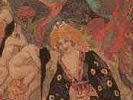
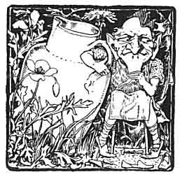
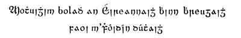
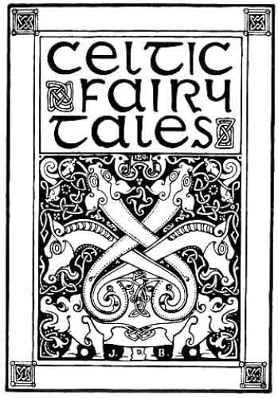
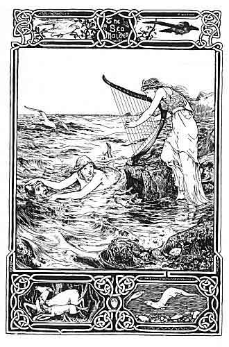

  
[Intangible Textual Heritage](../../../index)  [Legends and
Sagas](../../index)  [Celtic](../index)  [Index](index)  [Next](cft01) 

------------------------------------------------------------------------

[Buy this Book at
Amazon.com](https://www.amazon.com/exec/obidos/ASIN/B0027A7X88/internetsacredte)

------------------------------------------------------------------------

  
*Celtic Fairy Tales*, by Joseph Jacobs, \[1892\], at Intangible Textual
Heritage

------------------------------------------------------------------------

# Celtic Fairy Tales

##### Collected by

## Joseph Jacobs

###### Illustrated by

### John D. Batten

 

#### London, D. Nutt

#### \[1892\]

Scanned and proofed by Phillip Brown. Formatted at Intangible Textual
Heritage, 2003 and 2009 by John Bruno Hare. This text is in the public
domain in the US because it was published prior to 1923.

*SAY THIS*

*Three times, with your eyes shut*

 

*And you will see*

*What you will see*

   
Title Page

   
Frontispiece

*To*

*Alfred Nutt*

------------------------------------------------------------------------

[Next: Preface](cft01)
